**Camp X-Ray (-550m): Inside the Hollow Mountain**

**Underground Camp Logbook Entries** **2010-2011**

**Vodla Sled 2010** **The** **Return to Camp X-Ray**

[Logbook cover]

**22-7** **Nick**

After about 6 hours of caving finally made it down. Met Gergely and
James on the way down as they were leaving the cave. Last bolt before
camp is horrible - needs rebolting/rerigging - 15cm lower would be
awesome. Built a tent at the camp. Required stone movement. NEED WEED!
Should have thought of it before. Listening to Massive Attack and
getting raptured. Oh yeah! Kate setting up sleeping space, Jarv went to
get more water. Camp is getting established. Looking forward to Worm’s
World Party. Mike - cooking. Weed is really a missing resource. So far
so good. About 5 metres from camp is a hole with water in it, able to
hear, quickly got established as peeing corner, hope it’s not a lead...

**23/7/10 Jarv**

Nice snooze - super warm. Nicola snored like a trooper - just a few
minutes into the classic Black Adder session. Broken sleep - probably as
Nicola got up for 2x piss. Awoken at 10:30am by the beasts crawling up
towards our pits. Tetley and Myles rustled up some hot-choc, then
wandered off down the continuing passage.

**23.7.10 2:10pm Myles**

Entered Gardener’s World at 6:20 am. Made our way through, rerigged
Zimmer on the way down. Arrived at camp at 10:30am and awakened Jv,
Mike, Kate and Niko. Wandered down Friendship Gallery for an hour or
two. Found nice lead, will investigate later. Sleep now.

**23-7 2:20pm Tetley**

It’s good to be in a sleeping bag at Camp X-Ray - seven years after the
last camp here. It’s very comfy - I like the tent - some things don’t
change though, Blackadder on the sound system, smash and tuna etc.
Hopefully we’ll get some good pushing in tomorrow!

**23-7 6:20pm Tetley**

James and Dan arrive for a quick visit before heading off to push the
Muddy Window.

**8:20pm** Andy and Gergely arrive - I ignore them!

**23-7 10:30pm Myles**

Fucking body won’t fall asleep! Must have only had a couple of hours at
most since Dan arrived. Gergely and Andy turned up at 8ish and now they
have checked out Leopard a while. Tetley’s bodily functions are out of
control! May bring some corks down for his digestive tract next time.
Anyway, now for some food and tea and hopefully can stay awake till
bedtime at noon!

**23-7 11pm Tetley**

Myles and I share breakfast/dinner with Gergely and Andy. Fine food!

**24-7 12:20 James**

Breakfast with Tet and Myles. Dan and I will visit the lead we killed
off yesterday (Muddy Window) and survey it, then to Red Cow.

**24-7 1:30pm Myles**

Back in Camp for 2^nd^ night. Pushed Tolminska today, good lead.
Surveyed till 8am. Some nice pitches, covered in mud. Listening to
strange foreign music.

**24-7 2:05pm Tetley**

Great push down Korita today - 8 bolts, surveying etc. It’s GOING,
GOING, GOING.... Go THERE! (But try and avoid rigging future pitches in
or near the water.....) Andy and Gergely have left to push Leopard -
James and Dan to survey Muddy Window and then go for a jolly below Big
Rick. It’s been a great day - thanks Myles. Time for a decent sleep.

**24/7/2010 23:20 Tetley**

James and Dan return on a high! 9hrs good kip in bed - I feel good!
Forgot to say I had a shit yesterday....

**24.7.10 James**

James and Dan went to Smash. Cool trip! Left \~80m 9mm by Red Cow.

**25-7** **Sunday! 2.15am** **Tetley**

James and Dan in sleeping bags. Myles and I contemplating putting our
furries on. Still no sign of Andy and Gergely - hope they’re OK.

**25 July ’10 3:15am Andy**

AJ and GA turned one crappy lead (Leopard) into lots of great leads.

**3:40** **am** **Tetley**

Excitement mounts as Andy and Gergely return with news of BIG
DISCOVERIES! Now the day train is close to crashing (in their sleeping
bags). Myles and I are about to set off for sunrise and beer. Can’t wait
to return!

[Andy’s sketch survey, Zimmer to end of Prince Consort Road]

**25.7.10 T- 5hrs to surface Myles**

First camp draws to an end. Been extremely fun if a little cold
sometimes. Will definitely return to explore my little rift, Tolminski
lead and Andy and Gergely’s big leads! I will be back!

**25.7.2010 Gergely**

Route after traverse needs to be marked! Crystals on ceiling. Take care
of them. p.s. See you in Hotel Tolminka!

[Gergely’s sketch topo of Leopard]

[Gergely’s sketch plan of Prince Consort Road]

**Martin**

MM and WF. Gas running low - not able to get full blast, off to Leopard.

**26-7 Kate**

Arrived at camp again. Hellish trip.

1\. Pulled Quad muscle. OW.

2\. Got big chunk of hair jammed in descended. Started slashing hair
until Jarv rescued and undid descender.

3\. Fucking toothbrush pierced magic drybag and the bristles soaked in
mud.

4\. Nearly died slipping down Pink Series pitch. Fell a bit. Shook me up.
David Bowie made things better. Hopefully lots of exciting exploration
tomorrow.

[Kate’s drawing of toothbrush stuck in mud]

[Martin’s sketch topo of Cheetah]

**Martin**

After a day at Leopard I have nothing to show for it. I have removed the
backup round the boulder on the floor and made a rope sling fit round a
rock bridge, which is going nowhere. After the second bolt there seems
little solid rock for a freehang and the walls are full of sharp stal.
The bolt William put in failed as the rock cracked and I was not
prepared to slice the rope by swinging back and forth looking for a
place especially as I was below the rub points.

**26-7-10 10am** **Jarv**

Awoken by Martin and William returning from their post-lunch look at
Korita (8am). Off with Mike and Kate to have our own attempt at the
apparent death trap on the far side of Leopard. Could really do with
some rawls - have drill but no battery, Arg! Will try our best and pop
back for lunch and turds.

**26-7-10 Jarv**

Leopard rerigging: Tough! 3 bolts in - 2 failed, one blew open rock,
other cracked and demoted to ‘deviation’ class.

[Jarv’s sketch topo of Leopard]

**Martin McGowan**: Rename it CHEETAH as you’re always cheating death?

So it’s not finished but it is \~50% safe. Needs lots of rawl bolts to
fix. Anyhow, it was good enough to get Kate and Mike down so we went off
to explore...

[Jarv’s sketch, A tourist guide to Wonderland]

[Jarv’s sketch showing Prince Consort Rd and Serpentine]

[Jarv’s sketch showing Serpentine]

[Jarv’s sketch showing Serpentine]

SERPENTINE is pitch down from Prince Consort Rd.5. Exit chamber
over/under big boulder and enjoy \~50m lovely meander with wet cascades
(care!) Ending in dubious freeclimb to pitch head above ledge and
continuation of big pitch. We threw the only stone. Rattle \~8s. Est
40-60+m

**Kate**

Smoked Mackerel fucking delicious. Just came back from Leopard and
Wonderland. Pretty exciting stuff. Still a bit cranky, probs hormonal or
just reluctant to be down here after just 1 day on surface. Being the
first one at the bottom of newly rigged pitch was immense, definitely
worth any grimness suffered or to be suffered. Wonderland is magical,
like a child’s playground but with big holes and sharp jaggedy rocks.
After new pitch gorgeous little streamway - quite small but not uncomfy.
SERPENTINE. Stopped at promising pitch and did some surveying. This
caving lark is pretty good. Good times dancing with Mike and making mud
covering on rock with ‘K’ spelt with stones. Getting out tomorrow,
wonder how long it will be this time till I’m back... Martin just shat
behind the tent and it smells horribly awful.

**27-7 10:50am** **Tetley**

Back again (with Myles) - 55 hours and only 1 sleep since leaving.
Smooth exit out on the 25^th^. Then Tolmin - 2 steaks! Rush of
enthusiasm as I walked up from Ravne - decided to come straight down.
Stayed up and packed after surface cavers went to sleep. Smooth 3hrs
down. We then went to Leopard extensions. Now bed!

**27-7** **Sometime around 11am** **Myles**

Back in Camp X-Ray after 51hrs on top. Couldn’t resist Tetley’s proposal
of 2^nd^ camp! Feels good to be back. I’m gonna’ fuck this cave up.

**27-7 11am Jarv**

Jarv, Mike, Kate To the surface once again! Lovely stay @ Camp X-Ray,
made much more entertaining by Martin’s situation comedy. Leads are
fantastic, Leopard is passable (drill and rawls to sort fully). Somebody
go there!

**27-7 10:30pm Tetley**

Great night’s kip! No cavers here to wake us up... Forgot to mention
that the camp stank of piss when we arrived... Smell has gone now...
maybe we’ve just got used to it. Installed a piss Daren Drum (Heavy
Metal). Location behind tent.

**27-7 Myles**

Where are all the cavers?

**28-7 00:10 Tetley**

We’re now leaving to Korita. Tet and Myles.

**28-7 12:55 Tetley**

Back from a storming caving trip! We met Nicolas and Gergely at Zimmer -
they slept while we pushed... Another 7 bolts added to BLACK KNIGHT
pitch at end of Korita. Once down the stream flowed into a duck. “There
will be a bypass” I declared…. and there was! The stream passage
continued – we stayed high. Eventually \~15m drop to stream. But Myles
found a dry passage – strongly draughting – that goes to a \~10m pitch.
This dry route we called SIDEWINDER. 130m in survey book. We left \~25m
of 9mm rope at bottom of Black Knight – nothing else left there. Great
trip – we returned to wake Gergely and Nick. James and Jan are somewhere
down Big Rock – hope they’re OK and back soon…

**28-7 1pm Myles**

Returned from this storming push with Tetley. We now have two pretty
beastly leads. Was a bit tired during final rigging of Black Knight but
perked up as soon as we found new passage. Now in underground camp.
Thought we’d killed it all when we found the duck but Tetley saved us
with his bypass seeking skills. Had to heat up Nick’s willies over the
gas stove until they were flexible enough to fit on his clodhoppers. Him
and Gergely are off to push now.

**28-7 3:15pm** **Tetley**

James and Jan said they’d be back from a Red Cow push at 11am. Got woken
at 2pm. We (Gergely, Myles, Nicolas, Tet) got rescue kit together… grrr…
I got out of my warm pit – put caving gear on. Gergely and I went to
find them. Glad to hear “Yes we are OK” when I shouted down Big Rock.
It’s good to hear the leads still going – good too to see Jan again at
u/g camp! So time to crawl into my pit (again!) for some sleep. I really
need it (the wee dram should help).

**29.7.2010 James**

Just woke up after an epic in Republika. Our sleep addled brains thought
we’d have enough time for a deep push… needless to say we just ended up
sleeping all the way: on top of survey stations…. On the good side the
drill does make rigging easier. Also the passage still goes to the max,
a 35m pitch, 30+ m of stream. Only stopped due to lack of ropes. Stream
keeps going. Also both pitches below the chamber have dry alcoves. PUSH!

**29-7 2:05am** **Tetley**

A broken night’s sleep… James snored like a pneumatic drill – he’s
becoming my nemesis! (Only joking!) Woken by Dan + Iztok + Gergely +
Nicolas. 8 people here it’s all very jolly. Bob Dylan on the sound
system, cooking, spliff smoking (by the new comers).

Tetley’s top tips

1 Pish before you shit

2 Pick your nose before sleeping

3 Use a lump of carbide and a plastic bag to dry survey instruments.

t.b.c!

**TH 29-7: 2.45 am Dan**

Finally into our sleeping bags. Izi and I came down 17:30ish. Got to
F.G. \~8pm. We checked out a few leads but no survey gear. Bumped into
other day (ish) train. back to camp \~1:30. delicious food. Now sleep!!!

**29.7 3am** **Gergely**

Good day of pushing with Nicolas; Rolling Stones chamber and then Hidden
Surprise passage. Did some bolting, now only a couple of
life-threatening rubpoints left. Tomorrow is the day for the pitch at
the end of Hidden Surprise. Camp is very home-like feeling, nice music,
carbide light, and 8 cavers – an underground paradise! Except for the
piss smell. Well, but everything has its downsides… This is going to be
my longest caving trip. Whoo! Now a good sleep. Funny day train steadily
drifts towards night train. It is said that our natural day is 20-27
hours long…

**29-7 13:45 Dan**

About to get changed. Procured survey gear (thanks Tetley) and drew
survey pages Off to push end of W.L. (If night train didn’t get there
first – still not back).

Dan’s top tip

Roll up the edges of the composting bag before taking a shit.

**2/46 29/7/10 Thurs Jan**

Woke up at u/g camp to the sound of water (lots of water), went to check
out Zimmer, and yes, there was lots of water. James hopes his little
tent is OK.

**30/7/10 Fri James**

Yesterday I took Jan down horror show: Esoterica…

**03.54 30/7.10 Dan**

Amazing pushing trip. Found the palace of King Minos. back \~1:30.
Others back just in time. Good day

**Gergely**

Made traverse at end of Hidden Surprise. Other end (cont. passage) is a
strange squeeze. Probably we were the first and last persons there… Good
company! Nice discoveries! Good cave.

[Gergely’s sketch showing Mudstone squeeze, Hidden Surprise, Rolling
Stones]

We did not go down to pitch. Far side is good rock; start from 2 bolts
on traverse. End of squeeze is still going, slight draught. Bottom of
pitch is better! Waits for you!

**Fri 10:40pm 30/7/10 Jan**

So, my amazing camping trip comes to an end, its been an exciting time,
it started with a 14hr trip to Red Cow – pushing 90m leaving a nice
streamway still going at one of the deepest parts of Gardeners World,
shared camp with Tet + Myles (good to be back in camp with Tetley-san).
Day 2 (Thurs). I bolted a traverse over to a window in Albert Hall
(above Serpentine), didn’t go. Looked at hole beneath PSS12 (Prince
Consort) pushed awkward rift to a couple of pitches ESOTERICA, left it
with two pitches undescended and looking good still. We looked at muddy
climb in Albert Hall (which turned out to be KING MINOS PALACE) but left
it for Dan + Izi, as we heard they were going to push it, all-in-all a
good introduction to the LEOPARD/PRINCE CONSORT RD series! Back at camp
we had the place to ourselves, but were expecting Jarv and Jana., about
10pm I woke up and heard lots of water (thought it was flooding up
Friendship gallery!) and it stayed like that for the next 24hrs. Day 3
(Fri), started at 2am with Dan, Ezi, Gergerly and Niko returning, and
tales of storming passage and the maze of KING MINOS PASSAGE! Which
sounded incredible, we decided to go and see what it was like and check
some leads left unpushed, we tried to understand Dan’s detailed survey
diagrams but it was all a bit complicated and disconnected! This what I
drew for Gergely after we came back…

[Jan’s sketch showing Palace of King Minos and the Queen’s Bed Chamber]

An amazing bit of cave! James looked down leads off MINOTUR RIFT and a
muddy hole with the sound of stream. In the Queen’s Bed Chamber the
draught must go up I think…? So after 3 days I’m feeling pretty broken,
but u/g camp is amazing. James and I are heading out soon, but I’ve lost
track of time, at some point in the last 72 hours we’ve changed trains,
but I don’t remember the station, only the destination. Thanks for an
awesome trip James!

[Jan’s sketches of Insomnia series and Esoterica]

U/G Bivi tip \#4

Put gas canister in sleeping bag to help Butane burn. (but take it out
of your bag before trying to use it)

**Sat (morning?) 31.7.2010 Nick**

So, my second trip to UG camp turned out to be quite long and
interesting. Gergely introduced me to the extreme caving = exploration
of unknown. Tried to remember all the stuff he had told me, but not so
easy. During the time we’ve been down here we’ve pushed Wonderland to
chamber now known as Rolling Stones (watch where you step) . Continues
with Hidden Surprise (crawl/walking passage with chamber in the middle).
Then Gergely put up a traverse (I wasn’t much help with putting in the
bolts) over an unpushed (\~40m) pitch (LEAD!), once we had the traverse,
it was kinda obligatory to check out the squeeze on the other side (now
known as Mudstone squeeze). Had to take harness off and several times
hammer action was needed. After about 40-50 m, the squeeze gets even
squeezier, we were quite tired, not much draught so we turned around.
Surveying was pain. Went to sleep (3^rd^ night in Camp X-Ray). Plan was
to get out but kinda didn’t happen as there was too much water in Zimmer
and presumably in higher pitches as well, so we decided to miss callout
and stay one more night. No pushing, just tourist caving, that was the
plan of the day. Went to check out passages discovered day ago by Dan
and Izi. Very Beautiful! Looks like it snowed there but upside down, the
crystal formations are crazy, definitely have to come down with camera
for photo trip. Jan and James stayed down here as well, and day and
night train kind of blended together. Now after 4 nights in the
underground we are finally going up. Thanks to Gergely the diet and food
down here was excellent, everything tastes better in the underground!

**31-7-2010 Gergely**

Our fourth night is over. We eat up the remains of our food, drink the
last teas and hot choc. There is no way back now; we must go up today!
The water seems to be a bit less than yesterday. Probably I will wear
all thermals; will be good when waiting for Nicolas at the top of
pitches. I wonder whether there was ever a 5-day underground trip on
Mig…

[Gergely’s sketch showing unpushed leads in Wonderland]

**31-7-2010 Gergely**

Chamber at the end of Prince Consort Rd has been renamed Albert Hall.

**1-8-10 Jarv**

Back to camp! Jarv, Jana, Martin and Shed. Arrived after the flood, had
a spot of tea to start things off – then photo gear to Leopard. Amazing
crystals and formations, unbelievable they are there really – only
managed to photo a fraction of them. Back to camp for \~1am,
noodly-mushroom-smashy goodness. Camp was a bit trashed – dirty
crockery, dirty water, spare turd loose in its plastic bag on the walk
to camp. The previous tenants clearly also had some obsession with
burning things – piles of ash everywhere, including cardboard from the
mess tins.

**1-8-10 Jana**

After 28h raining on top, our trip to u/g camp was postponed for 2 days.
Seeing all this new stuff, makes me feel I am in an old, exotic cave,
somewhere on a moon Billions of crystals everywhere! Now off to push
bottom of Korita.

**12:30 1-8-10 Jarv**

Martin and Shed have departed after two rounds of tea then hot choc.
Jana and I are absorbing noodles and listening to Fairport Convention.
Shared a single shit bag with her – the relationship that shits
together, stays together! Off to Push/Photo Korita/Black Knight. Back by
23:58.

p.s. Fixed external batteries for speaker and reflexed spine of this
fine tome – both are thus delicate!

**1-8 23:15 Tetley**

Back to Camp X-Ray! Karin and I had a smooth 3hr journey down – meeting
Shed and Martin near the entrance and Jarv and Jana at Zimmer. Good food
cooked by Jarv. Looking forward to a good night’s sleep then pushing
tomorrow.

[Tetley’s poor cartoon, Camp X-Ray by Day/Night]

[Karin’s excellent drawing “Someone somewhere in the cave”]

**2-8-10 Jarv**

Jarv and Jana. Pushed Sidewinder - to connection with envy! Great push –
arrived in tiny crack in ceiling (perfectly straight 10m), with phreatic
body tube that lead to challenging (?) climb of \~C3-4m down to envy
pitch. \*\*\*We derigged the Sidewinder + a bit pitch\*\*\* you’ll want
\~10m tat with hanger/million for backup and massive sling for natural
hang.

[Jarv’s sketch showing extended elevation from Sindwinder.8 to envy
pitch via the Crack in Time]

We photo’d to the best of our ability: A bit of Sindwinder, the duck
from the far side, Black Knight - bottom and middle – Korita middle.

Also day before: Albert hall, Muddy/NCB bit, crystals (Martin). With
Martin/Shed – Minotaur Rift, pretties on way to Queen’s Bed Chamber,
Stals on Cheetah, Cheetah itself.

Jana’s damaged her wrist, so its to the surface we must go.

Jarv’s top leads: Wet pitch at end of Black Knight – traverse along rift
to hang? Serpentine – big pitch, rock looks good – big ledge @ 20-30m
depth.

**2-8 10:20am Tetley**

Good night’s sleep in the old ‘buff bag’ – nice to think I was sleeping
in the same bag that we used at the Hotel in 1998! Camp X-Ray is
becoming more like home.

**2.8** **Izi**

Štartal smo ob 4^30^ z bivija. V kamp smo pršli mala pr zgoda tko de smo
šli pogledat kristale. Ka smo pršli v kamp so bli Tetley, Karin, Jana in
Jarv že zbujeni, tko da smo si nardil pašta, mala pobluzli in šli spat.
Zvečer gremo phat še mala.

**2-8-10 23:58 Tetley**

Karin and I had a great day looking at all the new finds beyond Leopard.
I put 3 more bolts on cheetah pitch plus deviation. We looked in vain
for more easy horizontal passage. Hopefully Tjaša, Erik, Izzy and Mawr
have more luck. Time for sleep now – James and Dave complete the 4 bed
camp.

**3.8.10 James**

Went to Ballamory with Dave, the plan was to free a boulder at the
bottom of Ballamory pitch. Unfortunately more rope than we had was
necessary.

[James’ sketch of Ballamory pitch]

I think we need \~50m of rope. Also looks like there is a lead before
the weird doubling back bit. On the way back we stopped in the fridge
and rescued some carry mats. caving near Cactus Junction is beautiful!
Thanks Dave.

**3-8-10 10:15am** **Tetley**

A good night’s kip. Erik, Mawr, Tjaša and Izzy have returned with news
of more discoveries. Found Rik on the stereo – good to hear him again.
Hvala Karin! (for a very pleasant few days!) back upstairs so hopefully
the sun will be shining – my vitamin D levels are getting low!

**3.8.10 Tjaša**

Dans smo šli obstickat minotaura in odspodi odkril še povodnega moža. Za
urško je pa štrika zmankalo Malo se bomo naspal in šli vn. Lepo smo se
mel. Hvala za dobr kamp Maur, Izi, Erik, Tjaša.

**4-8-10 Nick**

Came to Camp X-ray at around 2pm, faffed around a bit and went to show
Thara the newly discovered passages. Took camera with us and took pics
of the nice crystals, bumbled our way through Prince Consort Road to
Albert hall, where we decided to turn round. Nice sightseeing. Pushing
tomorrow. Hopefully. Since no one else came on the day train, we got the
whole tent to ourselves. Noodles and fish for dinner, Sadni Čaj for Good
Night. Camp X-Ray is as lovely as ever.

**5-8-2010 10pm Myles**

Arrived yesterday/today at 6am, went and pushed Korita series with Jarv.
Trying to kill it but is keeps going! Jarv was a tad broken before we
went to sleep. I will be tonight! Nick and Thara just returned, Nick has
a 100m^2^ hole in his oversuit. Left Tetley in a drunken state on the
surface.

**5-8-10 Thara**

Left for Kamikazi pushing front. Rigged down the 10m pitch. At the
bottom, there is a flowing passage which will be big enough for humans
in 1 million years. About 1m above the bottom there is a window which
turns out to be a lot of crawling/squeezes. There are two small chambers
along the way for us to stand. At the second chamber we climber down
into active water passage. Upstream is dead but downstream is blocked by
a squeeze worthy of Jana. We left unsurveyed as we forgot the tape. Next
we checked the window at the level of deviation. Same thing. It kept
going and the gap on Nico’s oversuit widen to cover both buttocks. On
the way out of the window, I heard a sudden change in water flow. It
must be raining outside 8 hrs before. (This was at 7pm). Surveyed in wet
conditions was not fun!

[Sketch survey showing Kamikaze and Lost Hopes]

**6-8-10 Jarv**

Jarv and Myles. After an epic 24hrs in camp waiting out the flood pulse
(hit @ \~7pm on 5-8-10), we are now getting ready to push Korita. I
wonder if others are coming from the surface… We’ll have to rotate back
on to the night train if a whole roster of 4 turn up for the dream-team.
Camp is super comfed with the roll mats from Cactus Jnc installed under
the tent.

**6/08/10 William**

James and William. Pushed a wet, so far unnamed pitch off Prince Consort
Road, could see what might have been the bottom about 10m down at which
point the streamway really started to pour down (must be raining again).
Eventually bolted to the apparent bottom which of course wasn’t, water
continued to hammer down a large hole in the floor, might have been a
challenge to rig and stay dry, but fortunately found a dry rift that
went over the active pitch (possibly). Another 40m down that should be
easy to descend.

**6-8-10 Jarv**

Jarv and Myles. Train crash! Having rotated onto the day-train we
collided with Tet, Fratnik, JKP and William. So we must away, a long way
to the bivi, at least, when you leave at two minutes to midnight… Korita
is dead, without explosive. Derigged entirely to the 3^rd^ pitch.

[Jarv’s sketch topo of bottom of Korita]

**6-8-10 23:48 Tetley**

Back again for my seventh night! Fratnik and I had a smooth 2hr journey
down. Met Nicholas and Thara just about to head out. Jarv and Myles are
here too (soon to go down Korita). James and William then turned up. TEA
all round! Fratnik and I eventually went for a tourist jolly to the
Queen’s Bed Chamber. then we went down to push Povodni Mož. Wow! A small
hole in a large dry passage soon leads to small fossil stream passage
then to nice Active stream. Went down 2 pitches (pushed by Izi, Erik,
Tjaša and Mawr). Bagged one more then half bolted another. Back to camp
for tea (and medals). It’s clearly raining outside – Zimmer is very wet.
Hope Jarv and Myles (now back from pushing Korita) make it out OK!

**7-8-10 9:50 a.m.** **Tetley**

Tea cooling down… Fratnik is making food, James is putting his wetish
furry on, Dirty Old Town playing on sterio.

**7-8-10 11:10** **a.m. Tetley**

Final hot vitaminski – then James and William to Serpentine, Tetley and
Fratnik to Povodni Mož. ‘Dangerous Dick’ is seeping slowly into my
subconscious…..

**7-8-10 11:15 p.m. Tetley**

Fratnik and I are back and well fed. A great days caving. Sadly Povodni
Mož is now dead, Up stream pushed to 30m+ aven, bolting downstream, we
eventually hit a sump. All now surveyed and derigged. Now time for bed.

**8.8.10 Fratnik**

Drugo leto spet, Do konca nikoli izhojenih poti.

**8-8-10 10:40 a.m. Tetley**

So… 8 nights I’ve spent down here – a what a great time I’ve had!
Hopefully next year will be as fun as this year! Thanks to all my fellow
inmates at Camp X-Ray – for the tea, the jokes, the laughs etc. Tomorrow
is the 9^th^ Birthday of Friendship gallery! Where will we be in 9 years
time???

**9-8-10** **19:15** **Jarv**

Jarv and Thara. Alright chaps and chapettes we’re taking the two packed
sacks and an extra with broken/superfluous tacklesacks and have unpacked
rope and fettled the armoury in the entrance. Grabbed a bit of rubbish
and Tet’s Nido tin. I imagine Tuesday wave will be with you around Noon
Tet, James KP, William and Nicola are in it.

p.s. Recharging your MP3 player – so long and thanks for all the fish!

**9/8/10 21:40 Kate**

Lie in till 4, Blackadder GOOD, throwing up BAD. Just come back from
investigating The palace of King Minos, the Queen’s Bed Chamber and such
places. Did intend to push but it turned out that Dan had made up his
lead and his descender is absolutely obliterated so no rigging was done.
Had a lovely trip, nice climbs and awesome formations. Mud whirlpools
and more crystals than you can shake a stick at = FAB. Cheetah is
horrifically terrifying. Back in camp, hurrah! last night this year,
it’s been good. Can’t wait to come back next year if you all will have
me.

**10/8/2010 1103 Dan**

Well well well, the final UG log entry. Almost finished packing up camp.
Kate just set of up. Left down are. Many tins of fish. tea bags and
sugar. Gas stove and 3 bottles of gas (2 big and full, 1 small and half
full) + lighters. In a D Drum w carbide for dryness. A few soups
chocolates + nuts. Hmm.. I guess I should get changed and leave. So long
till next year: X-Ray 3 – revenge of X-Ray.

p.s. I hope the Loperamide kicks in soon.

Further things left: Loads of rope, a few slings, some booze, 2 survey
tapes, a lump hammer, coal chisel.

[20100731-23-54-22-Jarvist Frost-Canon G5-CRW\_0405-Camp X-ray]

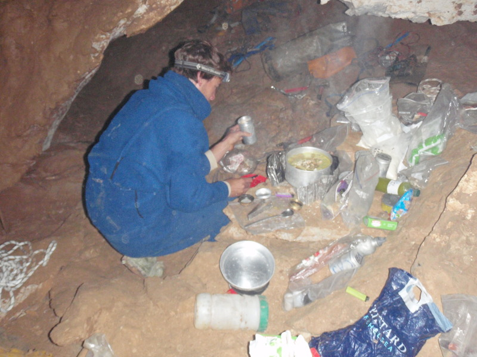

[20100729-13-06-55 - Iztok Mozir - P7294686 - Camp X-ray]**Izgubljeni
Raj 2011** **** **Revenge of** **X-Ray**

[The start of 2011…]

**21/7/2011 1.45am** **Jan Clare, Miles, Jarv**

Arrived! 5 hrs down from the sunny plateau with 7 tacklebags, Jarv
(hero) rigged from Space Odyssey. Jan was pursued by a strange chicken
smell which turned out to be a split packet of Bachelors Chicken Savoury
rice. Jarv (weirdo) arrived at camp first (\~11.30pm) imagining he’d
find an emancipated caver… instead there was a carpet of mould growing
on the debris of 2010. We spread sand on the mold, broke out the comf.
collected water, cooked food, set up the fairy lights and cranked up the
tunes! Aah yeah. Tomorrow we hope to recce Serpentine, limit of explo.

**10:20** **am** **Jarv**

Time to get up! reset my 9am alarm so we had a bit more of a snooze (the
Blackadder went off @ 2:30 am). Jan’s bladder has dragged us out of bed
– quite a tight callout, 10PM, so little time to explore.

**11:07 am (21-7-11) Clare**

Jan is cooking soupy cheesy smash while Jarv and Myles are lazing in bed
listening to Blackadder. I was dragged out of bed by my bladder but
since we didn’t have a piss BDH I did a Tetley special and pissed into a
resealable bag instead. Dribbled over pants a bit but otherwise OK. Camp
is super comfy and I don’t want to leave.

**11:22** **am** **Myles**

The morning after the night before. Awoke after slightly disturbed sleep
and thus forced to remain in my comf as long as poss. Clare pissed in a
bag, Jan cooked orange smash and we all listened to Blackadder. Camp is
5.3°C! Possible due to the biological processes of the mould
civilisation controlling camp. Now for a little bimble and then out for
tea and medals. WOOF WOOF.

**12:45pm 21-7-11 Clare**

Myles and Clare. Gone for a little bimble around Leopard. Aim to be out
for sunset. MP3 player died, think its out of battery. See you up top!
[Note by Jarv – charge it with the speaker USB-battery thingy!]

**5pm 21-7-11 Jarv**

Saw Clare and Myles down Albert Hall/Serpentine. Sniffed lots of leads
out with Jan:

1 Just after traverse on Consort Road (red rope). Dry oxbow on right
passage (narrow rift) goes back but doesn’t intersect passage. Echo
suggests pitch/chamber. Good lead for small fresher.

2 Near Esoterica, waterfall inlet on left. Climb down between boulders
(easiest is to continue towards Albert Hall down mud slope climb then
double back into crawl), follow water sounds to undropped 10-15m pitch.

3 Serpentine/It will Rain. Follow red rope down from Albert Hall – at
end of It will rain, fairly difficult 1.5m cascade/freeclimb to start of
pitch. We rigged \~5m to ledge, look down 10-15m (nice pitch!) into what
appears to be chamber (big ish). With water. Left \~25m 10mm in
tacklesack, also \~12m 10mm left @ end of It will rain.

Reheated tea and peanuts, time to head for surface!

Good luck team Thursday/Friday!

**22-07-2011 7:45 pm Tetley**

Johnny and Tetley arrived at X-ray after a smooth 4hr journey down. It’s
good to be back! Fairy lights… not so sure about them… Cup of tea then
off for a tourist trip down Friendship Gallery.

9:45 pm Arrived back from F. Gallery bimble to see Fairy lights… Ah…
already I associate them with all that’s good about u/g camp! Soupy
cheesy fishy smash for supper.

**22.07.2011** **Not** **sure what time…. Jonny**

First night at U.G. Camp! had a nice 4hr trip down to camp followed by a
quick trip to the Top of Big Rock Candy Mountain. Tasty dinner of cheesy
soupy fishy smash. Lieing in a sleeping bag watching Blackadder whilst
Tetley tries to make Zimmer nice. Camp appears to be comfier than bivi!
Looking forward to starting pushing tomorrow.

**23-07-11 2a.m. Tetley**

Yep left Johnny in camp to play on Zimmer for 3hrs, hopefully the new
rig is better. Returned to find Johnny almost asleep. Listening to some
Bach. Sleeping pills for Jonny, Žganje for me!

“For us going to the toilet is a mundane activity, for you it is the
basis of an entire culture” – the Red baron (Blackadder).

**23-07-11 Tetley**

Woke up 10:15a.m. Setting off to push leads beyond Leopard 12:30p.m.
Discoveries await…

**23.07/11 22:00 Jonny**

Just back from a nice pushing trip. Myself and Tetley headed to
Wonderland – hidden surprise, then kamikaze. After a short hammer to
make a squeeze bigger for me we followed a path next to kamikaze and
ended up in a larger chamber ‘The Red baron’ (see previous page). We
surveyed the area; promising lead, traverse across \~5m drop. Left the
lead to check the end of kamikaze. Turned out to be a “COLLECTOR’S
PIECE” (Tet) i.e. a crawl. End was blocked although sound of RUSHING
WATER was very clear and a passage could be seen through boulder –
exciting. Trip back was a bit arduous; dehydrated. Made it back to camp
for a great pint of tea, blackadder and the roar of Zimmer. Storm
possible up top? Still – interesting leas, possibly a horizontal
continuation? Making food – nice cous cous and sausage.

**23:00 23-07-2011 Tetley**

Top tip \#1 Don’t take Žganje and then take sleeping tablets.

Top tip \#2 If you go to push the exciting lead off Red Baron, take some
water with you to drink!

75m surveyed today, most in ‘Red Baron’, a big chamber. Many thanks to
DW and JKP for leaving us the storming and draughting lead, complete
with a PSS at the start!

[Tetley’s sketch of Red Baron chamber]

The lead: rope traverse needed over 5?m drop, horizontal passage awaits!

**23:58 23/7/2011 Tetley**

Went to empty piss BDH – still a lot of water coming down Zimmer.

**9:45 am 21/7/2011 Tetley**

A good night’s sleep, no headache this morning. Tea and Dangerous Dick.
Zimmer is still very wet – no other cavers have come to join Jonny and
me. I’m in a great mood, Jonny is perhaps apprehensive about the climb
out.

10:30 a.m. We’ve decided that Zimmer is too wet to start out… so we’ll
be staying warm and dry at Camp X-Ray for a while. The bad news is that
I’ll have to take a shit. grrr.

**10.33 am? 27/7/2011** **Jonny**

Avoiding going up Zimmer, flood pulse? Staying at underground camp
listening to music until a reasonable time to get out. May do some
bolting practice? here’s hoping that Zimmer decides to dry up a little
sooner rather than later

**24/7 14:45 Tetley**

It’s still bucketing down Zimmer! Jonny and I are still alone, Jonny has
now broken through the 48hr barrier. We’ve moved to half sugar rations,
oh life is tough!

**24.7.11 16:15 Jonny**

Amazing what putting in a single bolt can do. Moral boosted slightly
after contracting a bit of ‘the fear’ and speaking to Tetley about
stories of broken pelvis’, rescues and general caving deaths. Zimmer
still pissing down so we’ll wait until morning before making ascent, be
it wet or not.

[Small cartoon by Jonny showing a wet pitch]

More interestingly, seems like the stream near camp x-ray is likely to
be separate

from the Zimmer – water seems to come from opposite direction (Obviously
due to large amount of water). “Now don’t tell me I’ve nothing to do”

**24/7/11 18:20 Tetley**

After an hour of ‘Dead Ringers’ we’ve moved on to ‘Little Britain’…

21:25 Jonny and I have both been dozing, still no sign of other cavers,
what’s going on ‘up top’???

23:30 Clare and Jarv arrived at 10:40pm with tales of apocalyptic horror
on the surface – snow! storms etc. Looks like Jonny and I made a good
call!

23:38 Clare and Jarv gone to push lead off Red Baron – back to sleep for
Jonny and me.

**25.7.11 9am** **Jonny**

C+J arrived back around 7:30am having found \~200m of cave. Tetley and
myself now off to the surface. Little apprehensive to leave the comfort
of camp but after three nights it’s time to leave!

**25/7/2011 9:05 a.m. Tetley**

Final faff/fag before heading out. Many thanks Jonny for an excellent,
productive, fun 3 night camp – looking forward to the Laško I left at
the entrance

p.s. Thanks to all who’ve made X-Ray so pleasant – Jarv especially.

**25-7-11 10pm Clare**

Clare and Jarv. Arrived at camp yesterday night and left immediately to
push Red Baron after a chat with Tetley and Jonny. Found \~220m of
passage we named ‘The Throne Room’ on an 8hr bolt pushing trip. New Uneo
finally worked under Jarv’s loving touch! Night train is hard work
though – caving on autopilot on return to camp. Now in bed listening to
Blackadder over coffee and ready munch. Jan and Kate, Dan and Myles were
supposed to have arrived on the day train a few hours ago to kick us out
of bed but no sign of them. Where have all the cavers gone?

**25-7-11 10:30pm Jarv**

Jan and Kate arrive! Nice to see some other peeps. Strange condensation
on the sleeping bag – perhaps we can dehumidify the whole tent with
carbide?

Mornings in UG camp are a perpetual Sunday Morning. We had chocolate and
latte in bed. It was rather nice.

I think I slept 8AM – 8PM ish, with a little break for a piss and a sip
of water. Clare was making little sleepy noises, like a rabbit, but
apparently slept little.

The drill is much fun, v quick and efficient.

[Little cartoon by Jarv of him and Clare bolting]

Place 8 rawl bolts with the tiny 10-cell Nimh battery.

[Jarv’s sketch of the Throne Room]

Strong draught over traverse, mostly disappears after climb (stations
1-8). Suspect goes into window, about 4-5m above PSS.8 in chamber. Easy
climb but should preferably protect with bolts. Might be easier to
traverse back from .8

[Jarv’s sketch plan of the Throne Room]

[Jarv’s cartoon of Kate and Jan cooking]

**27-7-11 1am** **Jarv**

Jarv and Clare. Finally off – to push Round Pond! callout Noon 26-7-11,
should be back earlier to cook some breccy for K & J. See ya!

**26-7 Jan**

Arrived after \~10pm waking Jarv and Clare, who were happy to see
people. Had food and tea, went to bed after Kate danced to Duran Duran.
Jarv and Clare set off to Serpentine. Slept well, woke 9am. Jarv
arrived, had tea, Mexican rice + coffee.

**26-7-11 Noon Jarv**

Ensconced in the comf, watching Kate & Jan get ready. Today we did
pitches – pushed round pond → The Long Water. 40 cm straws in first
chamber, way on via boulder choke then pich up water to small 6m pitch.
Follow stream to cascade chamber – very pretty. Water goes down a pitch,
also climb to b/choke (a bit small for humans) which prob goes to same
pitch. Also, Clare found ‘Rotten Row’, continue past the first little
dried pool with pretty grey sediment into body-sized phreatic which
leads after a few twists to another pitch. You can see 10m down onto
ledge. Big sound of water but no sign of it.

Good stuff! Left tacklesack with \~50m of 10mm at foot of 2^nd^ pitch,
before cascade climb.

**26-7-11 10pm Jarv**

Woke at six & couldn’t get back to sleep, accepted this reality at 8 &
got up to warm some vitaminski in time to receive Myles and Mike. Sent
them off in the direction of Kate & Jan.

**27-7 10 50 am Jan**

Woke for a piss after a warm nights kip, Kate, Michael + Myles also in
residence at Chateau X-ray. Yesterday I spent 3.5 hrs bolting across a
traverse at Cheetah, Kate waited patiently at top.

[Jan’s sketch topo of Cheetah traverse. ]

The last thru-bolt only went in halfway, so the Spirit of Elvis was with
me as I scrabbled for a foothold and reached for the lip of the window…
and my light shone to the back for the first time, sadly it wasn’t
another exhibition Road but the bottom of a cascade. Still an exciting
traverse nonetheless!

We did a tourist trip to Red Baron chamber then back to camp, meeting
Myles and Michael. Watched RARG on the video player with Jarv + Clare +
Kate in a cosy ball of comf.

**27-7-11 11:30** **am** **Myles**

Mike and I arrived last night and after a brief visit to camp, went to
look at Throne Room. Nice cave! When we returned to camp we found 4
comf-covered creatures refusing to leave! I cooked 7.3 Kg of smash for
Mike + I before settling in for bed. I had a “Goonies” style dream, and
now Kate is cooking breakfast… Hopefully we’re off to push Serpentine.

**Weds 27 July? Kate**

Yo Yo Yo. Jan & myself are pushing Throne Room, expect to be back by 10,
callout 12. Same times for Mike & Myles who are Serpentine way. Lots of
love Kate.

**27/7/11 Mike**

Mike + Myles. Leisurely start at 1 ish and headed off to Serpentine.
Admired the extra pitches dropped since last year and followed Jarv’s
directions to Rotten Row. Looked at two pitches and bolted the easier
one with natural back up.

[Small topo by Mike]

Water headed on down, small hole + climb on left or follow water (1.5m
drop). Next pitch approx. 30m? – Didn’t descend whole way. Bolt on
floor+ rigged off natural + dropped \~10m Wet so swung over and
ascended.

[Another small sketch topo by Mike]

Derigged all as neither of us were happy with it. 50m of 10mm and \~10m
of 10mm left at top. Returned to camp 8:30 ish after quick survey.

**Thurs 28/7/11 11.15am** **Jan**

Jan and Kate. Just contemplating heading out. Had a great trip down The
Throne Room yesterday came back to camp to find Myles + Mike in bed
after an equally exciting push down Serpentine! Lots happening

We did two climbs in The Throne Room which lead to a storming passage
called ‘Amazing Grace’, after Kate played it on the harmonica while I
climbed, thanks Kate! You took my mind off the scariness + rapture.

[Jan’s sketch of Amazing Grace]

A good draught is going down ‘Amazing Grace’… We turned round at a muddy
climb so someone else could enjoy the push too! Go! Go! Go!

**24/7/11 Kate** **[Incorrect date!** **]**

My hands are extremely fucked so this may be short. Had a wonderful few
days underground. Camp is as lovely as ever. I’ve even taken to eating
smash which I thought would never happen after the incident with the
sleeping bag last year.

Had two pushing days, the first of which, despite Jan’s heroic effort,
was not so successful although we did answer the unanswered potential of
the window off Cheetah. Later that day after sitting at the top of
Cheetah freezing my bollocks off we went to find the location of the Red
baron and the pushing front where Clare & Jarv had an uninvestigated
window.

It was on Jam and my second pushing day that we went there. After much
prodding around Jan climbed and bolted a window above the Throne Room.
Meanwhile I played Jan’s harmonica. Annoying we found this window led to
a small passage running parallel to the easily accessible passage in
which Jarv had a shit and that these passages connected via a small
crawl. There was however another window as well. Jan climbed and bolted
this one which led to a wide horizontal passage. We excitedly stumbled
up the passage which then turns 90° to a downward slope. Quite nice and
passable with mud resembling bird poo coating the rocks. With time
running short and Jan wanting to leave it open for the next team (this
want I did not share) we stopped at a muddy easy climb. Could see
another 15-20m but after there who knows.

It’s wide, it’s horizontal and it’s blowing so what are you waiting for?
Go discover some motherfucking cave! Leaving now, Love Kate.

[Small cartoon/sketch by Kate]

**27/7/11 Izi**

Izi, Kletnik (nočna ptiča) **** Sva šla plezat okna v Albert Hall in
Minotaur rift ni blo uspeha. Pol sva šla pa v Serpentine zlezla okno in
po kratkem rova dobila majhno brezno na dnu po blatnem rovu naprej do
večjega… se nadaljuje (kletnk je predebel). Novi del se kliče: Let na
drugi svet

Camp was perfect!

Hope to be back soon.

HVALA ZA USE

[Sketch survey of Let na Drugi Svet]

**29/7/2011 4pm Tetley**

Back again – smooth sub 2 hr trip down. Good to see Izi + Samo. Off now
to Amazing Grace. Tetley and Clare

**1:25 am 30/7/2011 Tetley**

Clare and I have returned with 260m in the book – the new find, after
Amazing Grace is called the Magic Dragon! Gergely + Jana also here, in
bed, Jarv + Dan off pushing – more tomorrow after sleep!

**8:30 a.m. 30/7/11 Tetley**

Dan + Jarv have returned, listening to Ella Fitzgerald, reminiscing
about our great day yesterday…We rerigged Jan + Kate’s ‘Amazing Grace’
climb (see 3 pages back) so now the ‘abandoned climb’ is connected to
serenade PSS7.

[Sketch survey showing cave from Red Baron to the Magic Dragon]

**30-7-11 23:58 Jarv**

Night train Jarv and Dan. Tet & Clare finally back from pushing below
Republica – starting to get worried. Mike, Z & Stane passed during the
night – first at 3pm to drop stuff off & check in, then at 5pm to say
goodbyeee! Stane popped back to take a photo of the tent, and then off.
Nice to see them all, but disturbed sleep.

Yesterday we visited Magic Dragon – nice crystals/quartz. Degraded
rather horiffically after PSS.1 ; we started to bolt the pitch but the
rock was appalling. Broken & soft, quartzite broke the Spitz teeth. Got
a bolt in & natural back up, went over the edge in the horrific
muddiness. The obv natural over the edge turned out to be mud. The whole
pitch lip in fact sticky mud & white cheesecake boulders. From the
position I was in, sliding around with nasty muddy 9mm, I plumbed the
depths – 15.5m & then we bowed out. Slow return with cold SNOOZES on the
boulders to not be too early.

00:17 Jana’s here! Tales of horrifically muddy pitch leading to massive
pitch.

Tet & Clare have left ‘Daydreamer’ at a nice lead above a pitch in
stream.

**01:45 31/7/2011 Tetley**

Another top trip! Clare and I went down to push below Republica. Dropped
3 pitches and a climb, left big lead – nice 15+ pitch going down, white
rock, nice stream. Surveyed about 75m, PSS at end. DON’T go there if
water levels are high. X-Ray → pushing front about 3hrs ditto for the
return journey. It’s going, going, going!

p.s. Our new finds below Insomnia pitch are called Daydreamers.

**01:56 31/7/2011 Gergely**

Good pushing trip today with Jana at the end of the Magic Dragon! We
named the pitch ‘Stuck in Paradise’, referring to the muddy awkward
terrible nature of it. At the bottom there are two ways on, one pitch is
dead while the other drops to something big, big wind and echo. It gonna
be hard to push though because all you SRT kit is just a big lump of
mud! It will be fun… Nice new extensions, big sizes, crystals and so on.
Good to be back. I wouldn’t have thought last year that Wonderland will
lead to such big things! To the new extensions, Gergely.

**29.7 – 31.7 2011 Jana**

Jana + Gergely. Started late from the surface, we only had like 4hr
pushing. We pushed a small – on the right bottom – first chamber at the
beginning of Prince Albert Hall. Small passage went for about \~30m. Did
a small climb and looks it goes on. Climb not safe to check. Overall not
a massive great lead. After we went to Serpentine, where we checked Samo
+ Izzy’s push. Also de-rig the original rope at the beginning of
Serpentine as it got fucked.

Back at camp and soon Clare + Tet joined, followed by Jarv + Dan (night
train). Amazing Grace goes and pushed to the Magic Dragon. Clare and Tet
stopped at a \~15m pitch, which Jarv + Dan decided to push. Sleeping
time!

Woken up by Jarv + Dan, muttering about a muddy, horrid pitch. They
could not descent due to mud and then run out of time to bolt around.

Gergely and I decided to push it plus see all the new stuff. Clare + Tet
went to push insomnia. Amazing Grace + Magic Dragon is super pretty.
Loads of crystals again. The pitch to push is super muddy indeed. having
a drill made job a bit easier and Gergely did a great job. At the bottom
pitch splits in two by rock bridge. One way dies (sort of – a climb?)
and other is a big pitch (\~50). We named the place “Stuck in Paradise”.
Was so muddy you could not see your kit. Not very pleasant SRT. On the
end was completely covered in mud and looked like one big mud blop. Ha,
ha.

[Sketch survey of Stuck in Paradise]

**31/7/11 11:17am Clare**

Amazing two pushing trips with Tetley down Magic Dragon and Daydreamers
– Vrtnarija is now deeper than ever before! Put in my first bolts and
properly dropped first pitches; cheers Tet for an incredible camping
trip and great company. Top tip: hot brews at -800m is the absolute dogs
bollocks. Now all that’s left is a final prusik to the surface. I hope
Tetley goes nice and slow! he chased me up Big Rock yesterday. Till my
next camp, happy pushing to all.

**31/7/2011 Tetley**

So, July draws to a close, as does another great camping trip. Thanks to
Clare, you’ve been great. Looking forward to sunset and entering ^1^/~3~
km of survey data.

**31/7/ 18:30 Jana + Gergely**

After a muddy project yesterday, a muddy digging project today, where
again left at the top of the pitch. Great stuff, Jana

Good pushing and have fun. Watch out for the rapture. Gergely

**31/7/2011 Gergely**

Two digs at Friendship Gallery (don’t turn left after the rope, but keep
straight on). Upper one needs explosives; bottom one – the ‘Lower
Pleasures’ leads to a pitch (cca 20m). Quite good draught, a bit tight
(no SRT kit). Direction \~210°. To get to Lower Pleasures, climb down
between boulders next to the PSS in the last chamber of Fri. G. It goes
slightly towards Sys Mig; but worth giving a check for the wind also
watch out at the end, don’t fall down the pitch

[Gergely’s small sketch of Lower Pleasures]

**1-8-11 Jarv**

Jarv and Dan. What a sleep! From 2pm – 10:30 am, Wowser. However with
our surface callout in less than 24hrs and us having failed to delay it
we must head out today.

Yesterday we worked on the pitch below Long Water. Didn’t much like the
wet way pushed by Myles & Mike, we went off Rotten Row.

[Jarv’s ext elevation of pitch]

[Jarv’s plan of pitch]

Suggestion to keep on rigging is to keep on deviating on left wall, then
bounce to right wall into continuation of rift for the final hang.

The Y-hang gives a perfect hang to the spray lashed ledge – one could
just throw caution to the wind & zip down, slam in a bolt in the wet and
continue.

The rotten row PSS 1 was knocked off its corner, I hid the label in the
roof – it sits on the little ledge on the right about halfway down the
traverse.

[Jarv’s small diagram showing location of Rotten Row.1]

**1-8-11 12:40pm Jarv**

Much dead ringers later, and a spot of lunch & it’s time to go. We’re
both pretty stiff & sore – getting so cold on the wet pitch & the caving
back to camp clearly isn’t good for the body. Water levels still very
low – I hope someone gets down in time to push Daydreamers and Longwater
before it pisses down again!

Excellent clear up operation by the previous two teams – little left to
take out so we’ll tidy up a little, photo inventory & the elopc (After
some hot vitaminski)

Good luck team August!

Get the bolts & the metres in!

**1.8.2011 21^00^** **Tjaša**

Grega & Tjaša. We are going down the stuff (Let na drugi svet?) which
found Samo and Izi. We did some digging and heard a loud water noise.
There was a big draft. We came to water but we had no time to check its
way (we leave it for next day probably). Night!

**2.8.2011 22:00 Karin**

Nejc & Karin. We came down around 4:00 had some tea and then we went to
Lower Pleasure. We tried to bolt it but we just couldn’t. We came back
and sleep. Nejc is sick so we’re going out. There is some rope in Lower
Pleasure left (I think 2 pieces about 10-20m long).

**3 August 20:30 (morning) Gergely**

Yesterday we went climbing to the Queen’s bed chamber. No good luck, the
layers of good rock are separated by muddy layers which are unsuitable
for anything really. Despite the heroic efforts of Izi, he managed to
climb about 7m and came down. We left a rope in for further attempts
(which may involve some mud-stick operation). The window on the left
seems to be going.

Strangle, that now there was no wind at all in the end of Minotaur rift,
although last year it was a huge draught there. The reason may be the
difference in the water level. Today off to Stuck in Paradise! Good
luck, Gergely.

**3 August 2011 Jonny**

Jonny + Dave. Arrived 9 o’clock last night after faffing all day, 3
hours down. Woke at 8 this morning and set off to tackle Big Rock candy
mountain. I sat shivering whilst Dave bolted wind; too muddy, taking too
long, Headed down; nasty rebelay but looks like a large parallel
chamber/shaft! Same dimensions as BRCM. Too late, let someone else climb
up.

Camp super comfy and I feel very comfortable; no rapture

[Jonny’s sketch of Big Rock Candy Mountain]

**[Here ends the original white covered logbook – all the following
entries are from the red covered supplementary logbook]**

[Sketch by Tjaša/Karin showing things to do]

**4.8.2011 9:50am? Jonny**

Jonny and Dave. Fairly restless sleep but here I am, awaiting the
departure to the surface. Despite not discovering much yesterday, it’s
been a great trip, especially experiencing some expedition bolting
(cold) and de-rigging (fun). Hopefully I’ll be back in the next week,
even if it is for a de-rig. No sign of Izi + Gergely on the night train
– hopefully they’ve found something exciting at Stuck in Paradise.

**5/8 – 10:30 ish Mike**

Mike + Ari. Have just eaten my body weight in couscous (Dave decline
b/fast) and am both Happy + Sad. Off to go caving down the push on
Friendship Gallery soon.

**4/8/2011 13:20 Gergely**

Just got back from a good pushing trip with Izi. We found about 500m of
new passage at Stuck in Paradise! The rest of the pitch is the same as
the top: a muddy slopy loose-rocky thing. I thought Cheetah was
horrible; but now I was glad to come back after Stuck in P. The bolting
was fairly OK with some compromises; the who pitch – especially the top
– is quite loose, and it should be 1 person at a time! At the lower bit,
the rocks come down at the clear rock section, watch out.

At the bottom of the pitch a phreatic tube starts. This is similar to
Friendship Gallery in size. Plenty of crystals, very nice walking
passage for about 300m. Then a boulder choke blocks the way, but we
almost managed to climb through in the middle – there is a crack between
two large boulders which is just too small because of a ledge in one of
them, about 10cm big. This needs a chisel or capping. The passage
seemingly continues on the other side. Watch out for crystals please!

the other passage opens on the left of this one, it is quite low, but
this is the one that sucks the wind. Generally it is about 4m wide, but
filled with mudstone, and not higher than 1m (usually less). We followed
it for about 150m. At the end there is a boulder choke, which seems
passable on the top, but we ran out of time. Strong draught! Crystals
here too and STALAGMITES: about 5 stal columns about 20cm high, 5cm
wide. I think both of these are very good leads, although getting there
takes effort – this adds to the fun though!

Meanwhile it turns out that we left the instruments & survey book
somewhere, so tomorrow we have to go back for it. Part of the fun…. Good
pushing, Gergely.

ps. The rope in Stuck in Paradise is exposed to rockfalls, be aware!

ps2. The longer passage is called Lost Miles, the windier is Penitence.

[Gergely’s Stuck in Paradise rigging guide]

[Gergely’s sketch survey showing extensions below Stuck in Paradise]

**5/8/2011 13:00 Tetley**

Clare and I set off down GW at 9:30am yesterday. Smooth journey down,
meeting Dave + Jonny in Pink. Izi + Gergely were at X-Ray with exciting
news of 500m of new cave. “Do you want to see the book?” says Izi. NO
BOOK! They left the survey book back in Magic Dragon… One for them to
sort out, Clare + I were on a mission to Daydreamers. Dropped 3 pitches
there, but at the bottom of the last one the water disappeared down a
bedding plane crack… Grr, still I said we’d find a bypass and we did.
Left a good drafting lead, ‘The Penguin’s Egg’. Met Fratnik, Jarv + Jim
at Red Cow. Back to X-Ray for some much needed sleep. Thanks again
Clare, 140m in survey book.

**5/8/11 9am** **Mike**

Mike + Ari: below ‘Lower Pleasure’, “2^nd^ Time Lucky”

Went back Fr. am to drop our pitch with correct length rope. Epic faff
on my part which Ari did well to put up with.

[Mike’s plan of Lower Pleasure]

Two windows down pitch. 5m drop with water at bottom and rift going over
5m drop. Tightish but air fresh – no draft. Sorry Ari! Happy caving all.

**5/8/’11 15:30 Tetley**

Clare + Tetley heading off to Penitence, below Magic Dragon

**6/8/11 Midnight Jarv**

Jarv, Jim, Fratnik. The sun sets on another day train! Karin & Samo are
already snoozing in bed, we are awaiting the return of Tetley & Clare
while carrying out experimental cooking research.

Pretty tired and stiff after our long trip yesterday – we went to find
the Penguin’s Egg on our Winter Journey.

[Jarv’s sketch survey of Winter Journey]

Draft follows squeezes in inclined bedding, eventually wind disappears
into ceiling rift. Heavy silt deposit in lower region of chamber – near
backing sump? Mud stalagmites on rocks.

**6/8/2011 9a.m. Karin**

Samo & Karin. Let na drugi svet – Krtkova Dobra Dela – Heroj Telemarka…
…BAM! Samo fell, so we’re going out now. He had “luck” that he fell in
water. There are 3 leads with water way, 2 up & 1 down.

[A sketch survey by Karin]

**6/8/2011 4:20 a.m. Tetley**

Firstly, respect to those, especially Gergely, who pushed Stuck in
Paradise. Amazing push… truly heroic etc. Praise to to the electric
drill!

Clare and I went down to push the extensions beneath. We dug through the
boulder choke at the end of Penitence to find Salvation – 200m of mostly
walking horizontal passage. Drafting lead left. Forgot to take water,
despite my own ‘top tip’ early this expo, hence pretty dehydrated after
10 hrs caving, no water to be found. Grade 1 survey to follow after
sleep. A great day, only marred by news of Samo’s injury, I hope he’s
OK.

**6/8/2011 9:45a.m.** **Tetley**

Note re: Stuck in Paradise

Only one person should be on the pitch at a time. It takes 30-40 minutes
to ascend or descend.

If you shout ‘rope free’ at the top, you won’t be heard at the bottom
and vice versa…….

**6/8/11 9:50 a.m. Tetley**

Tjaša and Eric here after coming down and pushing on the night train.
Samo, Karin and Fratnik heading out soonish.

[Tetley’s sketch of Salvation]

**6/8/2011 1:20 pm Clare**

Another camping trip drawing to a close, quite probably my last pushing
trip of the expo! Just waiting for Jarv and Jim to return before we
start our bid for the surface. Once again, two successful pushing trips
down below Daydreamers and in the kamikaze extensions below Stuck in
Paradise. Another 340m in the book, and caving with Tetley’s always a
pleasure. Special thanks to Gergely & Jana & Izi for bolting and rigging
and surveying the worst pitch in the world (Stuck in Paradise) so
beautifully. We left a strong, draughting lead in Salvation below the
pitch, go push it!

**6/8/2011 13:30 Tetley**

Time soon to head up for tea + medals. Another great trip!

**6-8-11 22:00 Jarv**

Jarv & Jim. Another glorious morning down @ Camp X-Ray! Well, it is
night but who cares? Only hit the sack @ 16:00, thanks to sliding
forward in sync with Tet & Clare.

Just had a strange dream for caving – searching amongst Hipster pubs in
London with Jim; we were looking for other cavers but mainly for 1^st^
class toilet facilities. Here, alas, the piss BDH is full.

Yesterday we went to the Serpentine to try & drop the wet pitch. Didn’t
quite make it – needed a rebelay & found a natural but it was just too
dodge for the swing I’d undertaken. Jim was also shivering in a sleeping
bag, where I’d swung too was wet & NO PLACE TO HAND BOLT. Perfectly
possible to rig this pitch dry, but requires a fair bit of swinging & a
fist full of bolts.

[Jarv’s sketch of ‘Drink Your Own’]

Anyway, having made a stab at it, and grabbed a few quick photos of the
straws in Longwater we withdrew gracefully.

Well, actually that was bollocks as we derigged the whole pitch series &
found ourselves with three tacklesacks + a bolting kit through the
Serpentine meander. Pretty epic, as one was a massive ‘Big Bertha’
sleeping bag tacklesack stuffed to the brim with wet 10mm & metalwork.
Still, made it to Friendship for 2pm, having left @ 5am. A few plates
abandoned in-situ, as rawl threads damaged by hammer.

[Jarv’s sketch of Serpentine pitch rigging part 1]

[Jarv’s sketch of Serpentine pitch rigging part 2]

[Jarv’s sketch of Serpentine pitch rigging part 3]

**6.6.2011 23^00^** **Tjaša**

[For the next few entries, the recorded month changes, from 8 (August)
to 6 (June)!]

Erik & Tjaša. We are going surving (?) The new parts around Krtkova
Dobra Dela we founded yesterday Kletnk & Karin and if we will have time
do some pushing there. Lep pozdrav!

**6-6-11 22:50 Jarv**

Jarv & Jim. Well, we’ve had Hippy tea & a blast on the music player. The
gizmo is recharging & we’re going to try and get a little more shut-eye
before departing.

**7-6-11 13:00 Jarv**

Well! A bit more shut-eye turned out to be more than anticipated!

Erik & Tjaša came back very quickly from surveying – they got cold & wet
and crawled into bed with us!

A very long sleep but worth it. Jim is feeling a lot less stiff & my
back is popping less. Certainly the derig yesterday exacted its toll.

Camp is looking rather bare, nil shitbags, meths, sugar, hot choc, rice.
The train is crashing & it’s time to get off.

**14:48** **Jarv**

Good luck Erik & Tjaša, see you on the surface!

**7.8.2011 17^00^** **Tjaša**

We were surveying and get very wet. We had surved Heroj Telemarka that
found Samo & Karin yesterday. Samo falls into the waterand there is also
our surveying stopped. That is on the left side (part on Karin’s drawing
where are “two amazing lakes”). Then we went to the right. Karin had
written that there are 2 meanders but is only one. It just looks like
there are 2 because they’re one above another but after a few metres
they become one. That meander ends after 30 meters. There is water so we
couldn’t get over it. I think it is possible but you get all wet. So we
end after 30 meters. We do the last station on a rock wich looks like
this but we didn’t put any paper because it hangs from the cealing
(strop – SLO).

[Tjaša’s sketch referred to above]

We decided that the name will be the same as Karin & Samo gave it to the
nearer part and because they told us to go there. So, it’s named Heroj
Telemarka.

We eat 2 frutabelas there and go surveying the part which founded I and
Grega few days ago (that little canyon). We named it Krtek in Orel. The
last station is above the bigger pitch. We didn’t surved it down because
we didn’t want to get wet. Anyway, when we went back + swing on a rope
accidently under the waterfall and get wet. And Erik get wet in the
squeeze in Krtkova Dobra Dela. So, we were all wet in the end.

Shit happens : )

Under the bigger pitch Erik bolted something and it’s possible to go
down. If you follow the water you come to a lake and it’s impossible to
get there without getting wet (the level of the water is high to knees,
something like that). The possible way going further is above the water.
It’s something like passive meander, it needs to be looked one more time
to see if it’s possible go further without going into lake.

We’re going out today. See you and good luck to everybody!

Now I see that I left 2 pages empty. Ups

Well I can draw something

[Tjaša’s drawing]

**7.8.2011 21^00^** **Tjaša**

Erik and Tjaša. As it seems we are staying in camp because there is a
waterfall in Zimer. So, good night

**8.8.2011 11^00^** **Tjaša**

the water calms down slowly but there is still a lot of it in Zimer. We
hope that on the surface cavers don’t panic because we won’t come out at
the callout.

Today is Erik’s mother Maria birthday. It seems that he will miss the
party

**8.8.2011 14^00^** **Tjaša**

Much more water than in the morning.

**9.8.2011 14^00^** **Tjaša**

Finaly! Gergely and Tetly come in camp. It means we can go out.

Thanks for nice & warm camp! Tjaša & Erik.

**9 Aug 2011 13:45 Gergely**

This tear the last time in Camp X-Ray! We wanted to come down with Karin
to push Salvation, but the storm put us off. So today we came in 1.5
hours with Tetley to check if Tjasa and Erik were good, after 24 hours
their callout. Luckily, everything is all right and the camp is rocking
with music! Great times! The cave is still wet but it is time to go.
Another year, another expo, another success. See you next year!

To the connection and the new passages and to infinity.

**9/8/11 Tetley**

Exactly 10 years after the discovery of Friendship Gallery we’re packing
up and leaving for another year. A great year – over 2km of new cave.
Looking forward to returning in the future.

LEFT at X Ray 2011

5x 4.5 Flatcell

6x AAA bats

4x AA bats

1 kg carbide

20+ choc bars

12 tins fish

some nuts/noodles/soup

1 full power gas cylinder

+ 1/3 full power gas cylinder

1 large blizzard bag

1 tent

1 good 30m tape measure

500m + rope

+ 50m dynamic

10 slings

1 pair of Samo’s pants

25 spits and cones

40 stainless hangers

15 stainless rawl bolts

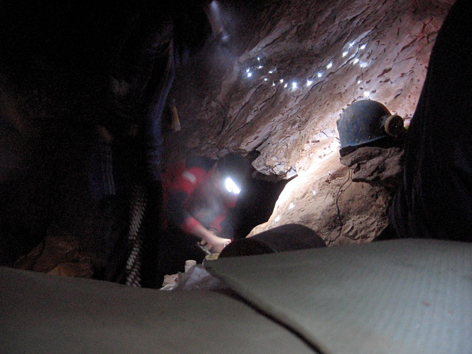

[2011-07-31-01.11.35-Jarvist M Frost-CanonA520-IMG\_0167 - Jana and
Tetely Cooking Lond Exposure]

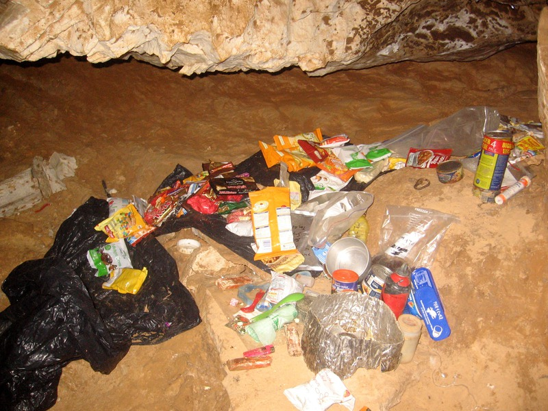

[2011-08-01-13.24.46-Jarvist M Frost-CanonA520-IMG\_0175 - Food Reserves
and Stove at Camp X-Ray]

[2011-08-01-13.24.09-Jarvist M Frost-CanonA520-IMG\_0173 - Dan Drinking
Tea in the Tent at Camp X-Ray]

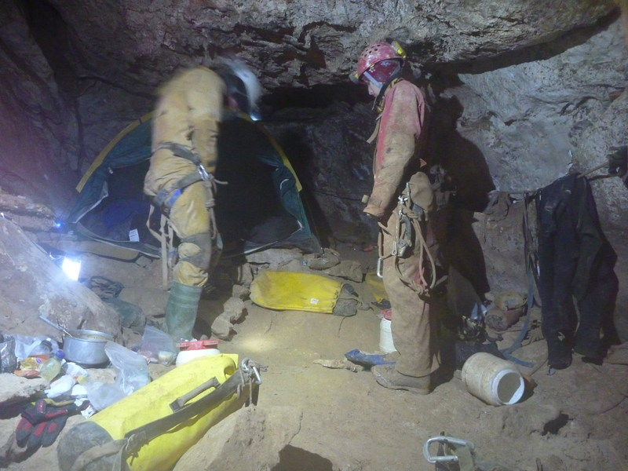

[2011-08-03-10.31.54-Grega-Panasonc DMC-FT2-105-camp x-ray]

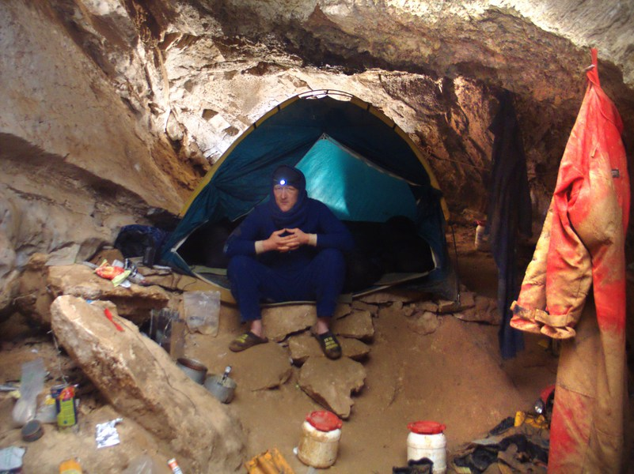

[2011-08-07-12.10.52-Jarvist Frost-CanonG5-CRW\_0178 - jim at camp]

[Editor’s note: Everything in square brackets has been added by Tetley.
I thought it was best to type up the writing; it took a lot longer than
I thought it would when I started but it’s been good reliving the
memories! I’ve tried to keep original spelling etc., but a few typos may
have crept in – sorry! Scan quality of drawings not the greatest, again
apologies. I added the photos to the document just for the memories….May
2012]

**Sledi Vetra 2012**

**11:45 Weds 18/7/2012 Jonny**

Back in underground camp one year later!\
A smooth trip down, everything has now been de-moulded in camp. Tea
ready, about to cook.. It’s good to be back!

**Niko**

Finally back in camp X-RAY, mental! Last time I was here two years ago.
Journey here was generally alrite, just Jonny sort of started leaving
tace sacks as he started rigging, so more load 4 us, but he did a good
job rigging. Zimmer annoying. Camp was quite mouldified, but Jonny
covered with sand. Cooking now, everything is alrite. Definitely less
rapture than 2 years ago. I just sort of thought that it’s a pretty
unique situation here. Cos normally whatever youre doing in life (eg
smoking weed) there must be a lot of people at that same instant around
the world doing the same thing, but I think at this moment, we are very
likely the only people in this world living in a deep underground camp,
like us. Crazy thought. We are truly alone. Waiting for cous cous.
Everything is alrite. So yea, Camp X-Ray 2012 is again in operation.
Enjoy!

**Oli**

Gone down more pitches than I can remember.. Underground camp is
actually much warmer than I thought it would be. Time for dinner –
Ainsley Hariets cous cous.

**1:47 am Friday 20^th^** **July Rhys**

Nice easy trip down to camp. Left at sunset, down for about midnight.
Have eaten cous cous, smash and sausage. I don’t know what I thought
camp would be like but I’m here and I like it. Hopefully shall have nice
long sleep.

**2:30 a.m. 20/7/2012 Tetley**

Back at X-Ray – the 4^th^ year we’ve had a camp here (’03, ’10, ’11,
’12). Rhys and I had a smooth journey down – now drinking Žganje and
listening to Blackadder. Now some sleep!

**11:40 a.m. 20/7/2012 Tetley**

A decent kip, slight headache though. I’m thinking of tea, and the
pushing front.

**12:47 p.m. 20/7/2012 Rhys**

Sleeping was good, camp is comfy. Breakfast soon, yum. Really excited
about pushing. Where else can you doss about in the sun one day and be
at the limit of human exploration the next day? Its going to be good.

**2:40 p.m. 20/7 Tetley**

The classic ‘Cheesy, soupy, fishy smash’ for breakfast. Almost finished
packing food, brew kit, bolting kit, rigging kit, survey kit. Had a
shit. Cup of tea then time to put caving kit on….

**Tet**

It’s 20⁰ Celcius down here – or so says the thermometer I bought in
Tolmin! Dr. Tim, a rubber chicken (and Samo’s pants!) are watching over
us!

“It’s not just about the pushing, it’s also about the journey.”

“Yeh”

**3:50 pm 20/7 Tet**

Rhys and I are finally heading off to Salvation. Back by 8 a.m. at the
latest.

**4:10 pm 20/7 Clare**

Good trip down with Jarv, great to be back at X-Ray! Nothing’s changed,
it’s like coming home. Had a quick chat with Tet and Rhys just as they
were leaving to push Salvation. We will be off to kill Winters Journey
and derig the Insomnia/daydreamers series. May also check out Red Cow
and Strap in the Nitro. Expect to be back 9am on 21/7, callout noon.

**4:15 pm Jarv**

Great to be back! Off to kill the deep stuff.

**21-7-12 6** **AM** **Jarv**

Back!

Pushed: PERFIDIA, a tight dry alternative to Republica (pitch). We were
hoping for a Red-Cow sump bypass.

Then went to the bottom & pushed WATERSHIP DOWN from beyond
WinterJourney.1 (where Fratnik & Jim opted not to squeeze) down a
[STUPIDLY] freeclimbed slope to a beautiful deep static sump.

The cave is thus deeper – perhaps 20-30m so.

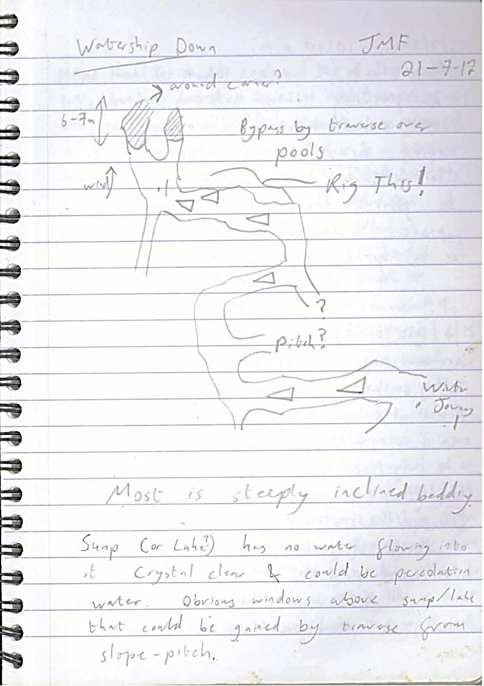\
[Jarv’s sketch of Watership Down]

Most is steeply inclined bedding.

Sump (or Lake?) has no water flowing into it. Crystal clear & could be
percolation water. Obvious windows above sump/lake that could be gained
by traverse from slope-pitch.

**21/7/2012 10:10 a.m. Tetley**

Rhys and I are back from a 17 hr pushing trip - ≈100m in the book. Cave
beyond Salvation named Brave **** New **** World. Clare + Jarv in bed,
we’ll soon be joining them in the tent – more tomorrow. Thanks Rhys for
a great trip!

**21/7/2012 6:57 pm Clare**

Jarv and Rhys are asleep on either side of me, Tetley smoking a fag in a
corner of the tent – all is well at Camp X-Ray! Excellent push
yesterday, even if everything we found (\~150m total?) seemed to be
body-sized or smaller!

PERFIDIA is a cool connection between Red Cow (pitch rope) and the start
of Insomnia. Saves a fair bit of time, though only go there if you
aren’t carrying lots of tackle and are shorter than Jarv!

Tried to kill Winter Journey but it won’t die. Amazing that there is so
much cave off an abandoned bedding plane that Tet and I explored out of
desperation last year! We found a series of rabbit warrens – little
crawlways at a bedding plane incline. Named it WATERSHIP DOWN. At the
end of it is a gorgeous terminal sump (or lake?). Named it MALA BOHIN
(?? Whatever that famous lake is called). Still a few unexplored leads
in Watership down, including what looks like a pitch. Take some rope.
There is loads at Red Cow Roundabout, and a length or two at the start
of Penguin’s Egg. If you want to get down to the sump, I’d recommend
rigging a rope down the final slope – I’d have been stuck there if not
for Jarv to stand on!

Right, going to try and grab more shut eye.

**11:36 pm 21/7/2012 Rhys**

Just woke up from 12 hour sleep, feeling good. Camp is nicer with 4
people. Tea now, hopefully breakfast soon. Selective memory has already
turned yesterday from mostly slogging through Penitence and Stuck in
Paradise to an amazing trip.

At end of Salvation we (mostly Tetley) hammered our way through squeeze
to cool chamber and then Tetley entombed himself digging into boulder
choke. This eventually led to weird streamway. Very drafty all the way!
Definatley two leads up and down streamway. New discoveries called Brave
New World. Looking forward to going back.

**21-7-12 11:47 PM (says my watch – feels like 10 AM) Jarv**

Fairly cool night (buf + a fleece liner with an irritating feet-sized
hole in the bottom. Legs kept on cramping – it’s a lot of exercise to
the new new bottom of the cave.

No nightmares about not being able to climb back up from Watership
Down.1 In fact I didn’t dream much at all. Just daydreamed of the
beautiful sump & the crystal clear water.

You wake after a push & rub the mudstone-sleep out of your eyes, sore
knees, stiff muscles & odd bruises in strange places. Hmm, anyway – back
to the cave.

Perfidia, the attempted Mad Cow Sump Bypass

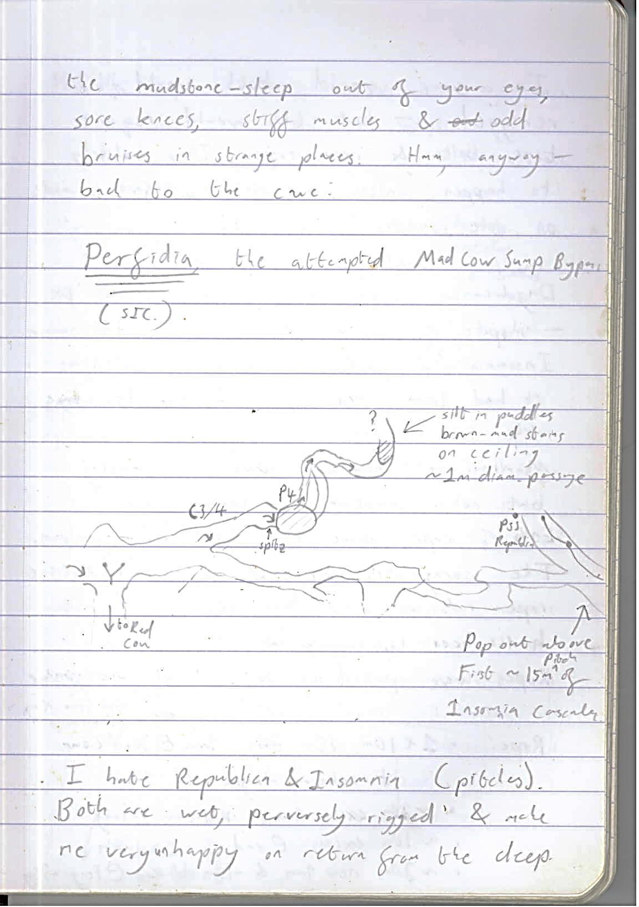\
[Jarv’s sketch of Perfidia]

I hate Republica & Insomnia (pitches). Both are wet, perversely rigged &
make me very unhappy on return from the deep. In a sane world both would
be rerigged – but this would require time, bolts & new rope. Thus
unlikely to happen unless a serious effort is made on the sumps.

Daydreamers rope was actually all OK – inspite of being left rigged last
summer. Insomnia I had to reverse prussic as it had been tied off (I
suspect) by the last climber last year.

Maillons in Dreamers were v.rusty but not structurally so.

Ends of rope where cut had been pulped. The swing-pitch above the pool
had extreme rope rub on where the horizontal section had been
tap-tapping on the floor. Ropes were pulled up & tied off were possible.

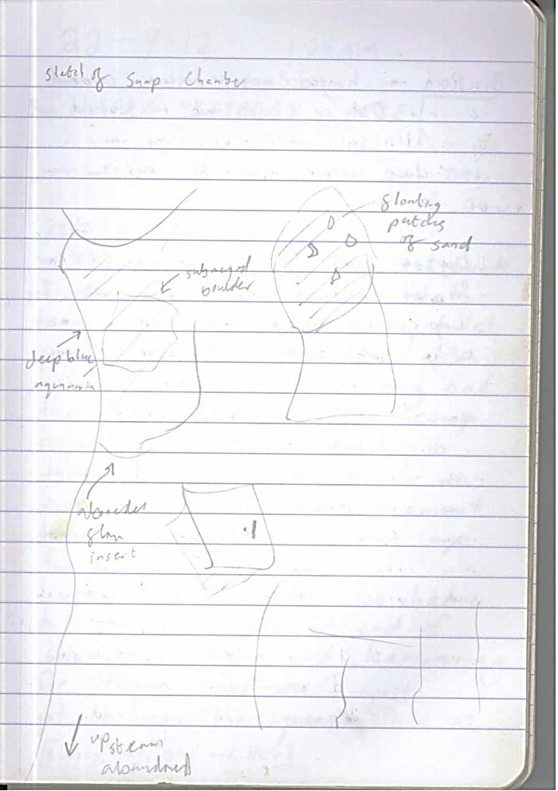Rope:

-   1 x 10m, 15m, 20m 9mm @ Red Cow (taken from X-ray on this trip) +
    unknown-length old 9mm
-   ̴20m excess 9mm on Red-cow Y-hang
-   ̴10m excess @ end of Insomnia
-   ̴20m new 9mm & ̴15m old 9mm @ Penguin’s Egg

Big Rock – hangers were rather corroded. Didn’t like it much –
substitute soon? All bolts were very loose – does someone come & loosen
them over winter? Odd.

Left a few dirn. arrows for Red Cow & back to Big Rock (as far as
Leprecaun pitch) Not sure if they help much, but we do try…

[Jarv’s sketch of sump chamber]

**22-7-12 1:24** **AM** **Clare, Rhys, Tetley & Jarv**

HAPPY BIRTHDAY PETE!

**22/7 2:18** **am** **Tetley**

3 pages are missing from the back of this logbook…. The first team down
forgot to bring toilet paper. Apparently the paper I’m writing on is
soft, strong and thoroughly absorbent! The camp setup team\* did a great
job though, X-Ray is as homely as ever, too nice at the moment to make
me want to put my furry on too soon.

[\*Jonny, Mike, Olly and Nico]

Great trip yesterday, we had hot tea and cake at end of Salvation.
Digging and hammering for 40 mins, and I just got through the squeeze
left at the end of last year’s expo.

Back in new territory. More digging and hammering enlarged the squeeze.
Rhys and I were now in a small chamber. Wind so loud through squeeze it
sounds like the roar of a stream.

Damn, no way on, big boulder choke. Wait… maybe up there, no… yes…
hanging death above. Tried to dig up but scary boulder led to a change
of tactics, went right, horizontal, under said boulder. Scary digging
up, but I had the draught and could see big passage above….

Soon I had a hole large enough to squeeze through. Told Rhys to smoke
all my tobacco if I should die and went for it. Crash. Collapse, I was
trapped. Well past the point where rescue is possible… Could just move
left hand… slowly, with the help of Rhys, I dug myself out and we were
through.

Its true to say that we weren’t in the huge, horizontal passage with
stals and gour pools that I’d dreamed about. But it didn’t matter! The
thrill of being in new, unexplored passage never wears off.

Up a slope (crawling) passage gets bigger heading east going up at ≈40⁰
to horizontal. We climbed up a slope until passage broke into what looks
like an active streamway (though it only has a tiny trickle of water in
it – not even enough to collect to drink). Upstream left unpushed,
downstream has the draught! We surveyed ≈20m down stream. Left
draughting bedding plane crawl as the going lead.

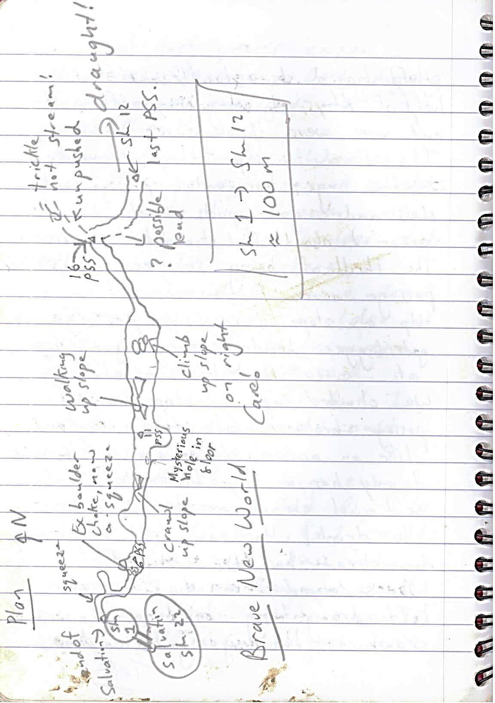[Tetley’s sketch of Brave New World]

**22/7/2012 5:20 am Clare**

Clare + Jarv off to push Throne Room. Expect to be back by 2pm.

**22/7/12 6 a.m. Tetley + Rhys**

We’ve found Xanadu!

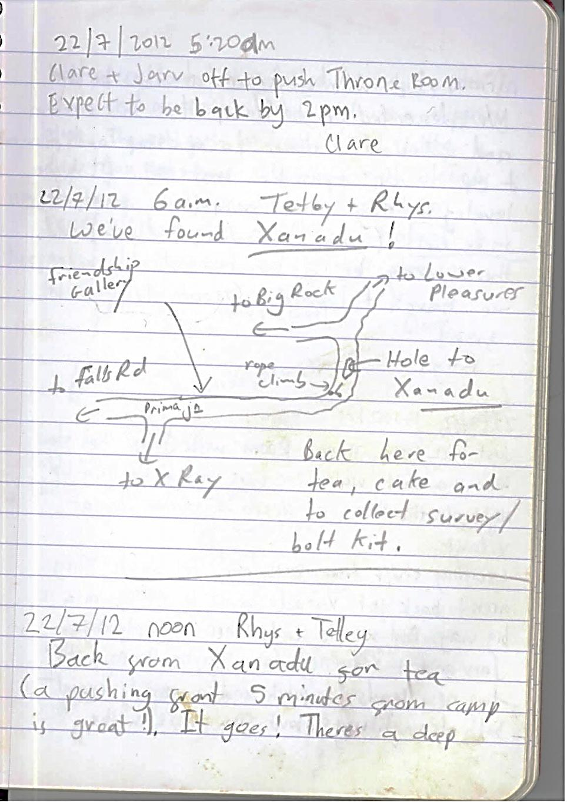\
[Tetley’s directions to Xanadu]

**22/7/12 noon Rhys + Tetley**

Back from Xanadu for tea (a pushing front 5 minutes from camp is
great!). It goes! Theres a deep narrow rift with a stream at the bottom.
We descended right down to the stream and followed it down to a sump and
followed it up to an impassable waterfall. At higher levels in the rift
we may have found a sump bypass (going to explore that now) and there
may be a waterfall bypass but we haven’t looked. Great trip so far!

**22/7/12 14:00 hrs Clare**

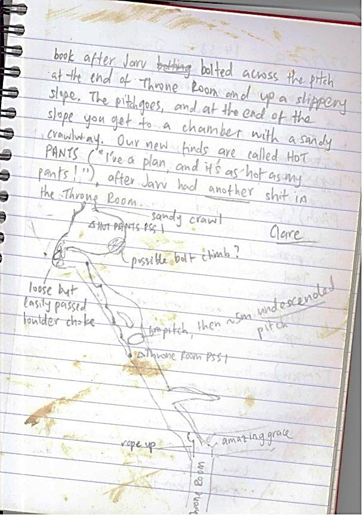Just back from Throme Room with Jarv; he’s having a shit,
water for cous cous is heating up, Night of the Proms on stereo –
another day at X-Ray!

Exciting stuff from Rhys and Tet above! They aren’t back yet, Xanadu
must be going in a big way. And so the leads keep multiplying…. Jarv and
I returned from Throne Room with two new leads: a pitch and a sandy
crawl – both draughting. About 50m more in the book after Jarv bolted
across the pitch at the end of Throne Room and up a slippery slope. The
pitch goes, and at the end of the slope you get to chamber with a sandy
crawlway. Our new finds are called HOT PANTS (“I’ve a plan, and it’s as
hot as my pants!”), after Jarv had another shit in the Throne Room.

[Clare’s sketch of Hot Pants]

**22/7/2012 14:38 Jarv**

Mmm, oil-less couscous. It’s been a while.

The Uneo proved its worth again attacking the two ‘sort of leads’ we
left at the end of the Throne room.

Pitch) Easily dropped with bolt on large boulder & tackle-bag rub
protected descent. Crawl opposite lead immediately to \~4m draughting
(sucking in) pitch. Possibly free climbable. Definitely goes somewhere,
I returned up to attend the traverse.

Traverse) Horrific to bolt. Rock v. dodge. All foot holds loose/dubious.
So much shit came down/on me. I found myself unintentionally landing on
my cows-tails more than once, and once a day is quite enough.

Traverse proceeds up 60⁰ inclined slope of death. Minimally gardened to
avoid slicing rope. Top section is a jammer/abseil section that goes
over a massive pile of boulders, extreme care & possibly a rebelay bolt
required.

From top of traverse (phew!) careful climb up slope & through boulder
choke to a fairly impressive chamber \~7+m high with passage leading of
at about \~4m above floor.

More importantly, a crawl goes from the edge of the chamber blowing into
your face over a white mud/stone blockage that is easily diggable (Clare
just slipped over). Apparently it continues on & on. Perhaps ideal for
the small wrigglers amongst us.

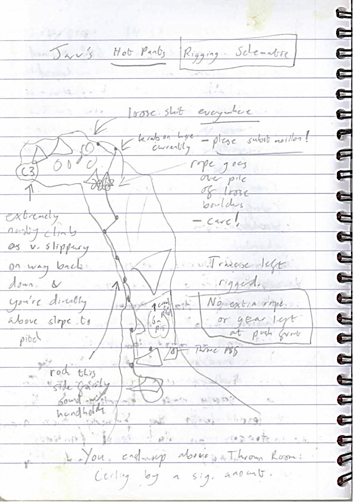\
[Jarv’s Hot Pants Rigging Schematic]

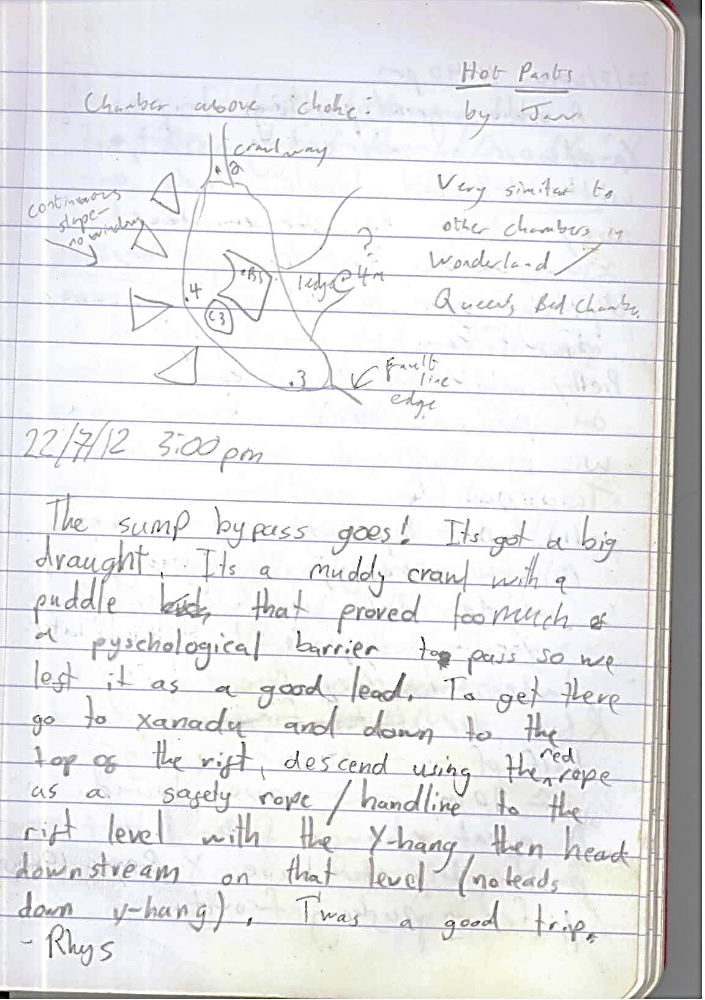\
[Jarv’s sketch of Hot Pants chamber]

**22/7/12 3:00 pm Rhys**

The sump bypass goes! Its got a big draught. It’s a muddy crawl with a
puddle that proved too much of a psychological barrier to pass so we
left it as a good lead. To get there go to Xanadu and down to the top of
the rift, descend using the red rope as a safety rope/handline to the
rift level with the Y-hang, then head downstream on that level (no leads
down y-hang). T’was a good trip.

**22/7/2012 4:40 pm Tetley**

Another great pushing trip. Xanadu is an interesting rift, with
different levels. Made our way down to stream level ≈30m below
Friendship Gallery. Upstream goes to a wet squeeze, downstream to a
sump. Pretty white rock, lovely ripples on pool of water, found what we
think is a sump bypass. Two possible leads –

1.  Push up high up stream
2.  The strongly draughting muddy tube with puddle (sump bypass?) –
    sketch to follow later

Interesting surveying, Rhys did book for half of our 18 or so legs. ≈90m
new cave found. A great change from last pushing trip to have X-Ray 10
mins from pushing front. Now in bed, listening to ‘the Ascent of Run
Doodle’.

**22/7 8:50 pm Tetley**

3 hours of (Žganje induced?) sleep and I’m awake again. No sign of a day
train…. One would be good on the deep pushing front but bad for me,
don’t want to get kicked out of bed. On Saturday the stream sounded
pretty loud (but not of the apocalyptic level Jonny and I heard last
year. Now it sounds fairly normal.

**22/7/12 9:01 pm Clare**

Really should be asleep, but am just on the wrong side of restless to do
so! Fingers crossed the day train doesn’t arrive to kick us out of bed…
Rhys has just got up for a piss, only to find the piss BDH full… so he
promptly went to Zimmer to empty it. What a trooper!

**23/7/12 1:22 am Rhys**

Sam and Mike have arrived looking for beds. Tetley has used jedi mind
tricks and convinced Clare and Jarv to leave now. More sleep for us then
out I think. I wish I could stay and push more but the surface and
dossing calls.

**23-7-12 1:34** **AM** **Jarv**

Oh no! They’re here…. Mike & Sam arrive, in search of comfort form the
storm.

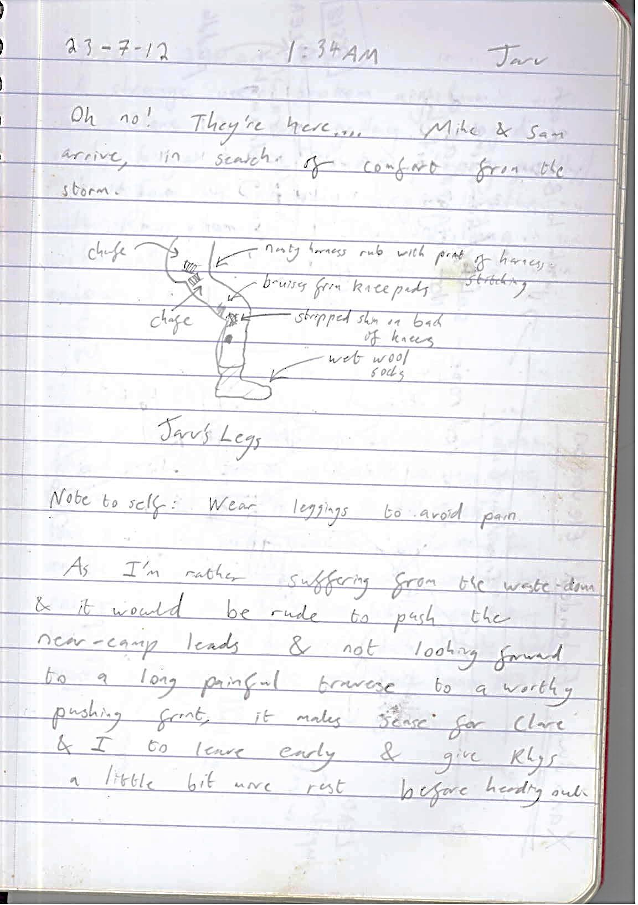\
[Jarv’s drawing of his chafed legs]

Note to self: Wear leggings to avoid pain

As I’m rather suffering from the waste-down & it would be rude to push
the near-camp leads & not looking forward to a long painful traverse to
a worthy pushing front, it makes sense for Clare & I to leave early &
give Rhys a little more rest before heading out.

\
[Tetley’s extended elevation sketch of Xanadu]

**23/7/2012 3:30 a.m. Tetley**

A strange very broken night…. Jarv + Clare are now getting changed ready
to go out (Blondie playing quietly). Mike + Sam in sleeping bags,
together with Rhys + myself. Jarv drilling with electric drill….. (to
make extra clothes rail).

**23/7/2012 3:30 am Clare**

Alas, Mike + Sam came down on the day train around midnight, just as we
thought we were going to have another 8 hrs in bed… Oh well, guess we
have to hit the surface sometime. Will be good to see the sun again.
It’s been a great camping trip, cheers Jarv! And Tet + Rhys for making
X-Ray fun. Excited to enter our survey data! Will be back soon to push
more leads, good luck team 2012!

**Tetley**

Some thoughts on pushing beyond Brave New World

-   It’s a very serious trip – don’t underestimate it, even a club
    rescue might not be feasible, a major injury would be a disaster
    best to think RESCUE IMPOSSIBLE
-   Take Water. Rhys + I took 1.5 litres each, this was about right. No
    water in cave from Zimmer onwards.
-   Recommended: a brew kit, (meths + fish tin). Hot tea and hot fish
    sandwiches went down a treat!
-   Allow a minimum of 4.5 hrs each way between X-ray and the pushing
    front.
-   Stuck in Paradise – Rhys + I went down and up in sections, one at a
    time, i.e. I went down to a point where I was safe from falling
    rocks then stayed at rebelay until Rhys joined me, we then repeated
    this. This worked very well!
-   On two sections on way down rope had caught around rock/flake so was
    very taut. Down prussiked/Italian hitched down.
-   ≈20m of yellow rope is at top of Stuck in P.
-   ≈40m of rope has been left at end of Salvation.
-   Rhys and I had a 17 hr trip.
-   Some draught from Amazing Grace all the way through to Brave New
    World pushing front. What’s driving it????

**23-7-12 03:52 Jarv**

So long X-Ray!\
Another fine 60 hour stay (check-in till check-out).\
Some great pushing, we’ve left some good leads – just treat the Throne
Room traverse & new deep bits with respect – they’re not as protected as
should be & rescue from both would be difficult if not improbable.

Off with the camp rubbish & flat drill batteries, and a too-exciting mix
of methanol & petrol (that first day in the Bivi mix up still haunting
us).

Safe caving, good luck pushing & see you again as soon as my sores heal!

**23/7/12 9:45 a.m. Tetley**

Rhys and I left the surface 85 hrs ago. Rhys throughout has seemed
utterly unfazed by his first camp, deepest trip, longest days pushing,
caving with me (!) etc. etc…. Mike snoring on and off, Rhys + Sam lying
silently in pits. I’m fully awake now, listening to Bach (and Mike’s
nose) and drinking tea. This cave and the cavers who push are truly
amazing, the combination of the two is something very special indeed!
It’s strange, normally after this much time underground I’m very keen to
see the sun; on this trip, however, I haven’t really even thought about
it. Is this a good thing or a bad thing???

**23/7/12 10:24 am Rhys**

Weird 19 hours in bed, was awake for about 9 hours of it I think. Tetley
making tea. Inevitable trip to surface rolls closer.

**23/7/12 10:30 am Sam**

Don’t think I got a great deal of sleep last night. I was plenty warm
enough… but it was difficult to drop off. Perhaps because of Mike’s
snoring? Anyway camp is a pretty cool place, and I don’t feel quite as
weirded out as I thought I would be. Trip down was ok, but long, because
I got caught up on the last couple of pitches. Up to then, everything
was fine, and motivation was high. Enthusiasm did start to flag… until
camp was reached. I like it here...

**23/7/12 12:50 pm Rhys**

Finally kitted up and heading out. It’s been an epic experience and I’m
looking forward to coming back, perhaps to push Brave New World.

**23/7/12 1 p.m. Tetley**

A great trip – thanks Rhys! Beer (and hopefully good weather) up top.
Happy cave hunting everyone!

**23/7/12 13:30 Mike**

Breakfast followed closely by lunch with the Flaming Lips providing a
‘spaced-out’ soundtrack; Nice to be back in camp, my best nights sleep
in X-ray as witnessed by my proud snoring! (Just prod me…)

Off for two gentle pushing trips this afternoon (I didn’t think SAM or I
want more at the moment) but it feels good to be surrounded by
Tetley/Jarv’s enthuasism and successes, hopefully we can provide more
answers to this Mountains mysteries!

→ Lower Pleasures (check bottom pitch, Avens ok)

→ Xanadu: check higher rifts etc

Back at Camp by 10pm

**23/7 20:00 Mike**

Back form a simple pushing trip with a few positive leads found at Lower
Pleasures.

Worth another trip see overleaf for two avens that are going leads.

\
[Mike’s sketch of leads at Lower Pleasures]

**23/07/12 20:05 Sam**

Mike and I just got back from our trip. Although not particularly
successful, as the first trip of its kind for me it was hugely valuable.
We first headed off for lower pleasures. Getting there was smooth enough
except a fair amount of time was spent removing a boulder from one of
the crawls. Once at the bottom, I poked my head around the potential
lead. Sloping up to the right was too tight; the only possible way was
ahead through a small rift with water at the bottom. (wet rift
streamway). Although I got a little way, the streamway narrowed so that
to continue one would have to be on their side, lying in water. Further
on, there was a very sharp corner which made it even more implausable to
try and pass. So, my first lead and a dead end! I then went up the first
rope and waited while Mike checked out another couple of leads, in a
couple of avens. Apparently these are promising leads, along with a
third aven which is harder to get to.

We then on our way back had a look around Xanadu. Nothing more was found
but it was fun to root around in such recently discovered passages. So,
I enjoyed the trip. It was short and relatively simple, which I
definitely required. I’m beginning to realise that I have a long way to
go before I can consider more serious trips. But these past couple of
days have been an amazing experience, and maybe one day I’ll be able to
come back. Camp is still awesome. Hopefully tonight I’ll sleep better
than last night, especially for getting to the surface tomorrow…

**24/7/12 Sam**

Second night at underground camp was better… I got a lot more sleep.
Looking forward to being back on the surface, despite feeling so
immensely confortable down here right now.

**24/7/12 Mike**

Also had a quick look in Xanadu yesterday; pretty sure I bypassed the
waterfall upstream and followed for 20m getting wetter legs due to
stooping until turning back……..

**24/7/12 13:00 Sam**

So, pretty shitty turn of events. I struggled going up Zimmer until the
rebelays, and was very slow, and Mike was concerned we would not make
our call out. So I’m back in camp for another day and night, and will
head out again tomorrow, with a later call out, so that I can take my
time being slow. Jonny and Niko have headed out pushing, so I’m in camp
on my own today. It’s the best way; to have an easy day today to have
max energy for tomorrow. My enthusiasm towards caving is at a minimum
right now. I would much rather be up top, but I’m ok lying around down
here. Hopefully when I am out, I’ll be able to laugh about all this, but
right now I feel pretty damn awful.

**6ish Oli**

Camp X ray once again! It’s far more pleasant than the surface has been.
Time for a quick smoke, piss, and 3 hours sleep to prepare for an
unexpected night train.

Niko comes back about 9:20 I haven’t really slept much, but some nice
sugary tea is coursing through my veins

P.S. Thara snored for about an hour also, somehow, he managed to squeeze
in a sleep.

**24/7 Thara**

Nico: I don’t want to see Gergely now. I’ll be with another caver and
he’ll be with another. It feels like cheating (on him.)

Oli: (answering the question of switching to night train) more caving
for the same amount of sleeping

Sam: When Oli and thara got here, I slept with them.

**24/7 22:40 Sam**

My afternoon was spent in camp, watching videos – Withnail and I,
comedies, cartoons. I was pretty happy eating and watching. When Olli
and Thara arrived, I tried to get some sleep whilst they did; I reckon I
got about an hour and a half of sleep. Nico and Jonny back now, and
food.

**25/7 10:01 Oli**

Thara and I got back about 8:30, cooked some cous cous with large
quantities of ghee (someones genius addition to camp) resulted

[I CAN’T READ THIS SHIT.]

**25/7/12 830 Thara**

Back from lower pleasures.

Still going horizontally if you are inclined towards Captain K.

Killed Sam’s Aven 1,2,

Possible wet climb up Aven 3?

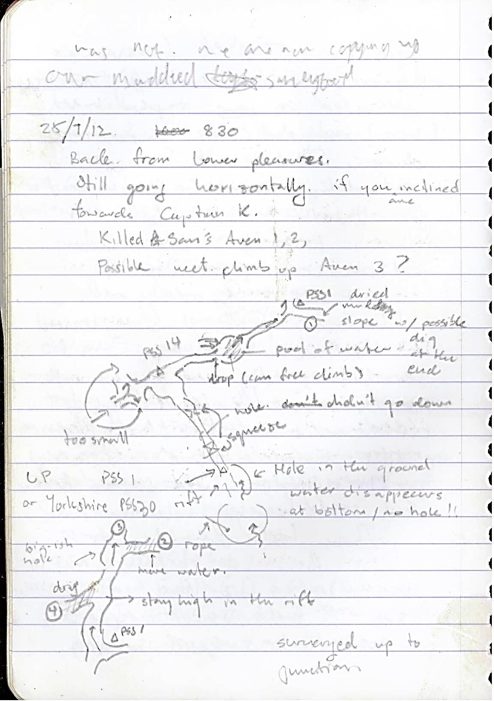\
[Thara’s sketch of Lower Pleasures]

at the bottom it is like Yorkshire cave!

**12:15 25/7/12 Jarv**

Here for a spot of Tea & to escort Sam out. I’ve always wanted to run an
escort service.

**12:40 25/7/2012 Tetley**

Back again! Rhys and I got out fine 2 days ago – we had 93 hrs
underground in all. Now here for daytripping, quick cup of tea and then
back up top with Jarv and Sam.

**11:24 Jonny 26/7/2012**

Woops, haven’t written anything in the logbook yet… Been down for 3 days
and I’ve had a great time. Helped Sam out on our first pushing day so
had \~1/2 a day in the throne room, not too much got done.

Went back yesterday and dropped 2 pitches to a boulder choke. Big wind
but it died at a dig

The lead at hot pants seems promising.

Overall, learnt a lot, had a good time and I feel I could stay down for
a few more days. To be honest, that probably would not be healthy.

The surface is calling!!

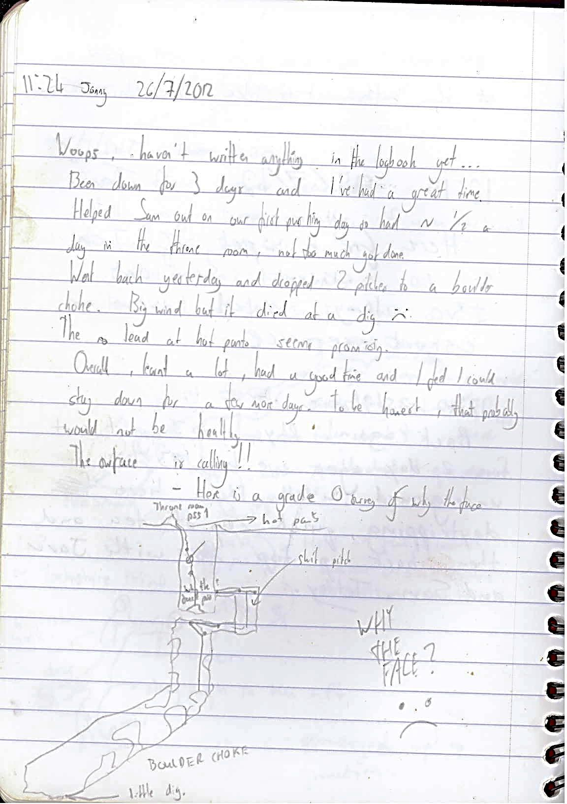\
[Jonny’s rigging guide for Why the Face?]

**26/7 12:20 Thara**

Oli + Thara went to Throne room / Hot pants to bolt climbing – Epic
Fail!

1.  Our BDH for water leaked = only had 1 lt to share ½ of which was
    drunk without this knowledge (\~2:00)
2.  Oli lost a spanner at Red Baron crawl (found later).

-left at 12:30 after mega faff

Attempted bolt climb at the top at Hot Pants. Left for the next party.

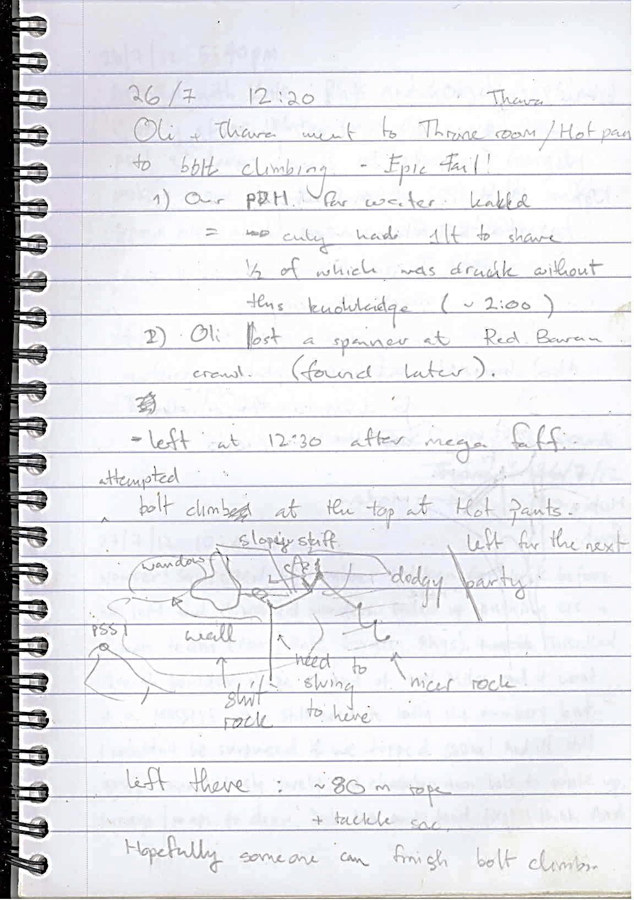\
[Thara’s rigging guide for Hot Pants bolt climb]

Left there: \~80m rope + tackle sac

Hopefully someone can finish bolt climbs.

Back by 10:30

Possible name: Peep Show

Note: there is a lead in the floor near PSS Throne Room 5 need checking.

Also haven’t set rope up to go down to the right window at Hot Pants.

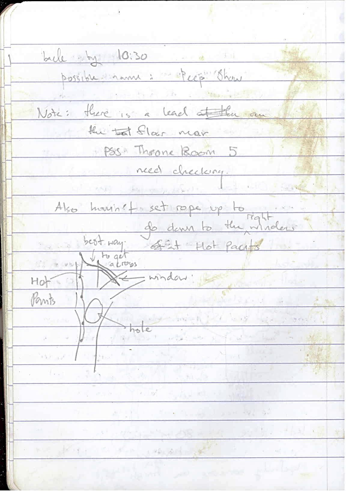

[Thara’s sketch of Hot Pants window]

**26/7/12 5:40 pm Clare**

Arrived with Kate, Rhys and Gergely appeared shortly after. Water crisis
at camp! Just put 3 daren drums at Zimmer. Gergely cooking now, we will
push Lost Miles and/or Brave New World once we have eaten meat.

**26/7/12 10 pm Thara**

After 54 hours underground time to surface and rise like a phoenix!
Thanks Oli. Good caving all round.

**27/7/12 10:42 AM Clare**

Wowser! Squeezed the rubber chicken for luck before we left and it
worked wonders. Ended up pushing as a 4 man team (Clare, Kate, Gergely,
Rhys). Chiselled through boulder choke at end of Lost Miles and it went
in a MASSIVE way. Still need to tally the numbers but I wouldn’t be
surprised if we topped 500m! And it’s still going. Found lovely lovely
stal chamber too. Lots to write up, surveys/maps to draw, but tea and
food first I think. And sleep.

**7/28 6 am Gergely**

Yesterday pushed through the boulder choke we left w Izi last year, the
trick was to have a chisel w us. The passages down there seem to be
endless! Found about 650m; mostly surveyed with the laser by Rhys & me
(loads of 30m legs). Still loads of leads (map to come).

Found water at the bottom of Stuck in Paradise & named that chamber
Hawaii – a possible campsite. A bit epic trip of \~21 hours.

Now off to Minotaur rift, checking out the squeeze at the end which
follows the fault line. Also changing some rope and checking the wind.

Good luck!

No music – too bad.

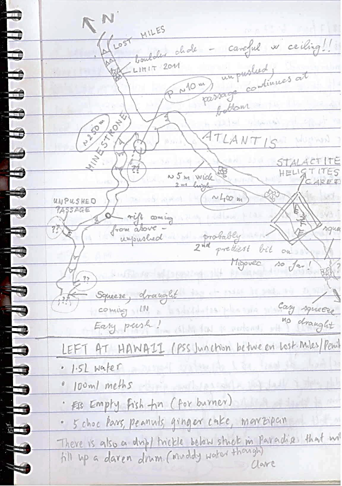\
[Gergely’s sketch survey of Atlantis and Minestrone]

**Clare**

LEFT AT HAWAII (PSS Junction between Lots Miles/Penitence)

-   1.5 L water
-   100ml meths
-   Empty fish tin (for burner)
-   5 choc bars, peanuts, ginger cake, marzipan

There is also a drip/trickle below Stuck in Paradise that will fill up a
daren drum (muddy water though)

**28/7/2012 6:27 a.m. Clare**

It’s Saturday already! Where do the days go when you’re underground?
Rhys and Gergely are just beginning their faff to go to Minotaur Rift.
Kate is still broken from yesterday’s trip so I will let her sleep more.
May try to persuade her to go to Xanadu later.

As Gergely said, grand day’s pushing down Lost Miles yesterday. Was a
nice change to push as a four, plus Gergely and Rhys surveyed Atlantis
while Kate and I fucked off (very slowly!) back to camp. Bonus! Still
can’t believe how much easy walking passage we found. And that gorgeous
stal chamber – finally some proper stal pretties on Migovec!

The problem with pushing the passage below Stuck in Paradise is the time
it takes to get here… perhaps a little 2 man bivvy? We’ve already
established a little outpost at HAWAII (the junction of Lost Miles and
Penitence) – there’s a brew kit (meths (100ml), fish tin burner), bits
of choc/food, at least 1.5l of water. There is a trickle of muddy water
that fills a daren drum quickly at the bottom of Stuck in Paradise.
Maybe a 4 man team to bring down buff bags, roll mats and pots, candles
etc, then 2 push while 2 sleep, before swapping? Hmm… well, I know I’m
going back to Brave New World/Atlantis/Minestrone regardless!

We have no music at camp – came back from pushing to find a note from
Thara + Oli saying the charger had broken and they were taking it to the
surface for repairs.

(Rhys + Gergely callout 8pm, expect to be back 4 or 5 pm)

**9:15 AM Clare**

Kate and Clare off to push Xanadu. Back by 4pm.

**2:00 pm Kate**

After some route finding in jungle rift found the pushing front of
Xanadu. By this time already I had foolishly got wet and got even wetter
crawling through puddle at end of Xanadu. Passage quickly gets bigger
after puddle and after a small climb there is a pitch left unrigged that
can be pushed. We started surveying the \~30m of new passage but before
we could connect to Xanadu got too cold and instruments too muddy to
carry on. Only 2-3 legs to connect but unfortunately there will be a
station in the puddle. V. cold still so writing illegible &
unintelligible. Defo learnt my lesson though. Don’t get wet whilst
pushing! Xanadu is cool though, you should go.

**28/7/12 2:10 pm Clare**

Kate and I went to Xanadu for some easy pushing. Named our finds
EUPHRATES. It is possible to not get too wet crawling through the
puddle. Unfortunately what was nice dryish sandy passage after the
puddle is now a muddy crawl!

\* EUPHRATES PSS 11 and Xanadu PSS 18 need to be tied in. It is only 3
survey legs. Kate got hypothermic and instruments got too muddy too read
so we turned back. At the end of Euphrates is a 5-10m pitch, draughting.
Bring rope!

Will try to sleep now in case a day train arrives to kick us out of bed.

**28/7/2012 9:20 pm Gergely**

Just got back & had dinner & tea & Vitaminski with Žganje, which is
great.

Today we pushed the squeeze at the far end of Minotaur rift. It was
pushed by JKP to a boulder choke before. The place is interesting
because it directly follows the fault line of Minotaur rift. So we
headed there with Rhys. On the way there, we rerigged the handline to
Leopard, the top rebelays of Cheetah, and the traverse in Prince Consort
road. And had a look at Queen’s Bedchamber – the climb seems to be
doable!

So, the crawling passage goes. But not easily. The passage is usually
0,5-1m high, 1m wide, full of sharp rocks, and both the ceiling and the
side walls tend to fall off. We got through the first boulder choke in
about 2 hours. Then, immediately after, found a squeeze with 3 large
boulders, which we couldn’t remove. Luckily, there is just enough space
to squeeze through (but it is tight for us as well!)

The third choke gave the name to the passage. So there the continuation
goes down on the left. However, large bits of rock are on top. A fat
rock of size \~1.5m x 1m was just in front of the passage, but when we
tried to move it, it started to slide down & almost blocked the
continuation. We managed to stabilise it somewhat, but as you go down,
your head is just below it… Good luck! So, the name is GUILLOTINE.

Altogether, we found about 85m of squeezing passage. Then, first we
found a small chamber off to the right with water, and the fault line
\~10m long, \~5m high. The stream goes off to a tight meander.
Continuing in Guillotine, a further 30m brings you to an opening to the
right – and you find yourself at the top of a \~30m high rift! This is
along the same fault line as Minotaur, but is an active streamway. – we
could hear water at the bottom. It is large, and goes directly towards
the System. Beautiful white walls!

In the squeeze, we found hematite pebbles and sometimes along the fault
line, the rock looks like marble, which would be very nice apart from
the fact that it constantly falls on your head.

So, altogether, we are \~100 m closer to the System on this level, and
the continuation is at the bottom of a large, open rift – sounds quite
good…

Now, time to sleep and hope nobody comes.. We managed to shift back to
the day train. Good luck.

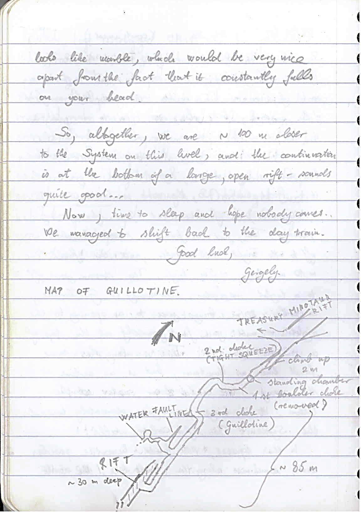\
[Gergely’s map of Guillotine]

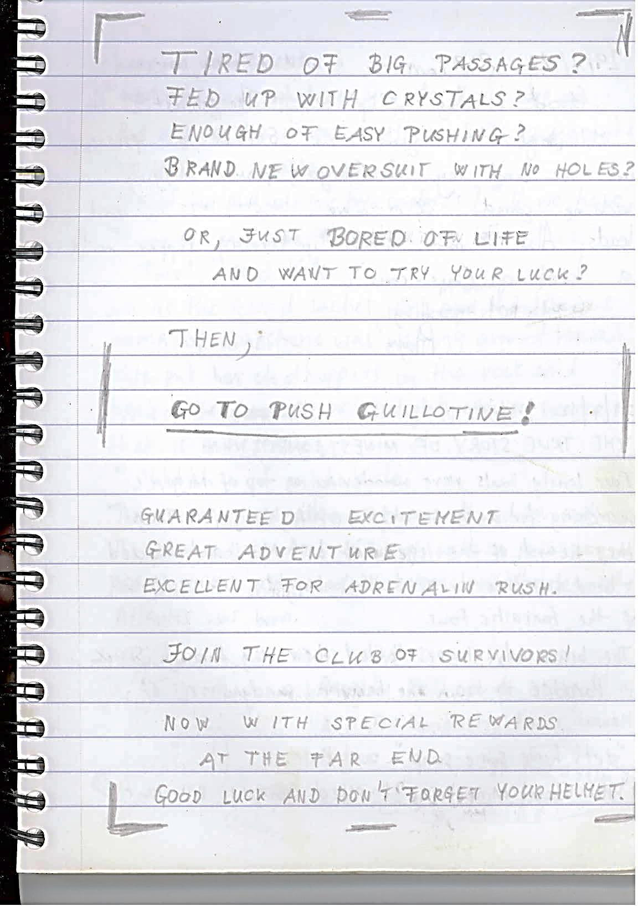\
[Gergely’s recruiting pitch for Guillotine]

**29/7/12 8:27 am Rhys**

Good 2 days of pushing. The fantastic 4 managed to find over 600m of
passage and me and my 1 Gergely-power digging machine found 80m more!
Left lots of good leads. Also I made dinner yesterday ‘Pepper with a
hint of Cous-cous!

Good luck pushing.

**29/7/12 9:36** **am** **Gergely, Kate, Rhys, Clare AKA The Fantastic
Four**

THE TRUE STORY OF MINESTRONE

Four lonely souls were wandering on top of Migovec searching for a cause
worthy of fighting for. Then they heard of the legend of Lost Miles and
decided to band together to create the almighty caving force of the
Fantastic Four.

The brave adventurers battled their way through Stuck in Paradise to
reach the beautiful sandy shores of Hawaii.

“Let’s have some soup,” said Kate.

“How about Minestrone?” asked Gergely. All four cheer in excitement.

“Now guys, whatever you do, don’t step on this rock or the minestrone
will go everywhere,” Kate said in a superior air.

“Should we put one or two sachets? If we have one we can save the other
for later.”

“Two!” said Kate.

Just as the second sachet went in and the delicious aroma of minestrone
was wafting around Hawaii, Kate put her clodhoppers on the rock and
toppled the almighty power source that is minestrone.

“Ohhhhh…” said Kate.

The rivers of spilt minestrone flowed towards the promised land of 650m
of walking passage. And thus the passages of Minestrone and the
beautiful Atlantis was born.

\
[Kate’s illustration for The True Story of Minestrone]

**30/7 8:30 am Clewin**

Andy Jurd & Clewin Griffith

So Andy and I just finished probably my comfiest night at an underground
camp so far. Camp X-Ray has come a long way since the first cold &
draughty version I stayed in with Rik back when we pushed Big Rock Candy
Mountain and Highway 32.

We’re off to push Minestrone and hopefully not get lost on the way. It’s
going to be a long day…

**29^th^** **July 2012 – Andy**

Andy + Clewin

Another one of those nostalgic trips for me: Exactly 12 years ago to the
day Clewin and I discovered Swing Pitch, and the really tight pitch-head
at the top of the Tessolater. We were so keen, we came back the next
day!

**30^th^** **July 2012 – Andy**

Clewin and Andy

15 hours to the pushing front and back…

Even if we didn’t get lost on numerous occasions, there still wouldn’t
have been time to do any actual pushing! What a waste of a trip – but
good exercise taking rope/drill/electric bits and bobs/survey stuff
there and back!

That muddy pitch with the forgettable name is a bit rubbish too – yuk!
(there is a water bottle under the drip to the left of the last rope).

The lead at Minestrone is a bit rubbish too – the passage becomes
completely blocked with rubble, but even though there is a draft, it
would need more than the two available (plus a JCB) to clear it!

Suggest a second camp closer to the pushing front! – But there’s not
much water!!!

PS don’t use the eye-lotion!

PPS – too cold for the class to work – suggest taking the cylinder to
bed with you!

**Jarv 31-7-12 3:51 PM**

Dropping by on a solo bounce.

I deliver: 1 fin

1 faber 7L 232

w/ 220 bar air

8 kg lead on a belt

Trying to squeeze 1 lukewarm coffee out of the gas canister – gobble a
few midgets & then depart for the surface.

Mmm, gas died – onto the meths!

Interesting trip down – rope work was OK but arduous.

Freeclimbs were scary – 20 kg of extra weight made stepping down to a
foothold v. dodge!

Camp seems nice – a pity to see it so empty though ---

So:

**1/8 /2012 JONNNY (+ NICO) 19:00**

Ahhhh!! Back in camp!

Hand a morning/afternoon working super-hard in the bivi (ahem…) and a
faultering of enthusiasm when entering the cave. As such, our pushing
for today shall be limited to pushing play on the music player.

Checked that the drill is ready for a trip to Throne Room tomorrow and
it all appears to be in shape

OH NO, can’t get music player to work

Nico:

“I stopped listening for 3 seconds because I was desperately trying to
get my cock out”

**2/8/12 Izi**

Mawer in Izi

Prvo sva splezala enih šm v Minotaur Rift, gre še naprej, samo je plast
zemlje enih km na dolyem, ki je nisva vspela preplezat. Pol sva šla v
Queen bed chamber, tam sva splezala 6m višje od lani, že zmer je do vrha
enih 6m + je treha traverzo da prides do dobre skale.

**2/8/12 JANA**

JANA and GERGELY

GUILLOTINE -\> RAZOR

Amazing to follow the fault line in such way, so close. Very tight in
places. Surveyed about 60m. From Guillotine passage you pop out in open
space, called Razor. “Dead” as to tight to follow the crack, possibility
to climb up (\~20m) look like could be a higher passage. Way back was
shitty, dragging 2 bags up 100m tight slope.

Time to rest now.

**Jarv – 2/8/12**

Frustrating time down ‘Esoterica’ – if that is where we were.

I think that Jan & James traversed over the pitch we wer trying to get
down. We failed – driver broke.

\
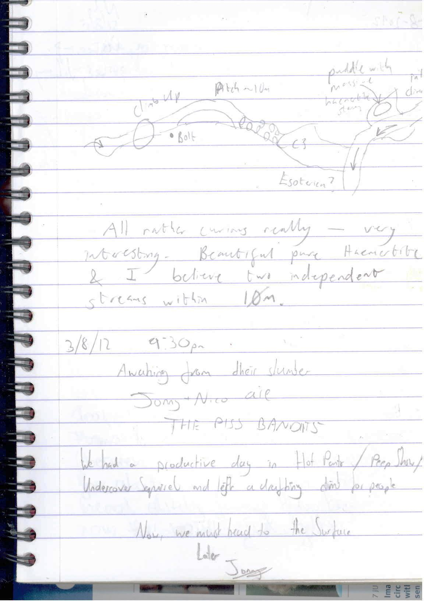\
[Jarv’s sketch of Esoterica]

All rather curious really – very interesting. Beautiful pure Haemertite
& I believe two independent streams within 10m.

**3/8/12 9:30 pm** **Jonny**

Awaking form their slumber.

Jonny + Nico are

THE PISS BANDITS.

We had a productive day in Hot Pants / Peep Show / Undercover Squirrel
and left a drafting climb for people.

Now we must head to the Surface.

**3-8-2012 Niko**

Alrite wackos, my last morning in UG camp. Quite a trip. Doing these
couple of pushes Johnny & me formed this deadly & amazing combo “the
Piss Bandits!”. Overall we found 3 passage thingies “Why the Face?”
“Peep show” “Undercover squirrell”. Loadsa fun, glad I was part of it
this year. Rock on UG camp, Sayonara from Niko

**3-8-12 Jarv**

Another glorious morning at Camp X-Ray – this one actually a morning.
Bowie on the fixed stereo. Our plan: Watership Down, below
Daydreamers/Insomnia/Republica/Mad Cow. A long way down – to -900m.

-   Be very careful with the AA-\>MP3 lead – just charge the player &
    then put it somewhere safe
-   Don’t use comf for a pillow – it get soaks with condensation!

**3/8/12 Jana**

JANA, IZI, MAWR, GERGELY = The Eastern EU team

WENT TOGETHER TO HAWAII CAMP, WHERE WE SPLIT IN 2 TEAMS:

GA + NM -\> BRAVE NEW WORLD

JC + IM -\> ATLANTIS

JANA and IZI

We have not seen the new stals etc, so we went to have a look + to take
some photos. Acording to Gergely the way on was ? and tight. We found 2
ways on we chose the Right one as it looked less tight. After a squeeze
we went down a small dry muddy sloape popping into very small “chamber”.
From here a super tight squeeze (between rocky celing and floor) for
about 10m. A water was heard already from the beginning now the noise
just getting louder. We came out like at the bottom side of a very big
pitch above. A new big waterfall coming down and a good amount of water
going down. We free-climbed down to the bottom of it. Got wet under the
waterfall. Very big place, looks like a canyon, we continue climbing
down, following watter and eventually stop as rope is needed 2 get down.
As far as Izi could see there were water pools.

Very interesting finding after so many dry passages.

A place where we need to go back!

We named it: BREZNO SLAPOV -\> Waterfall Pitch

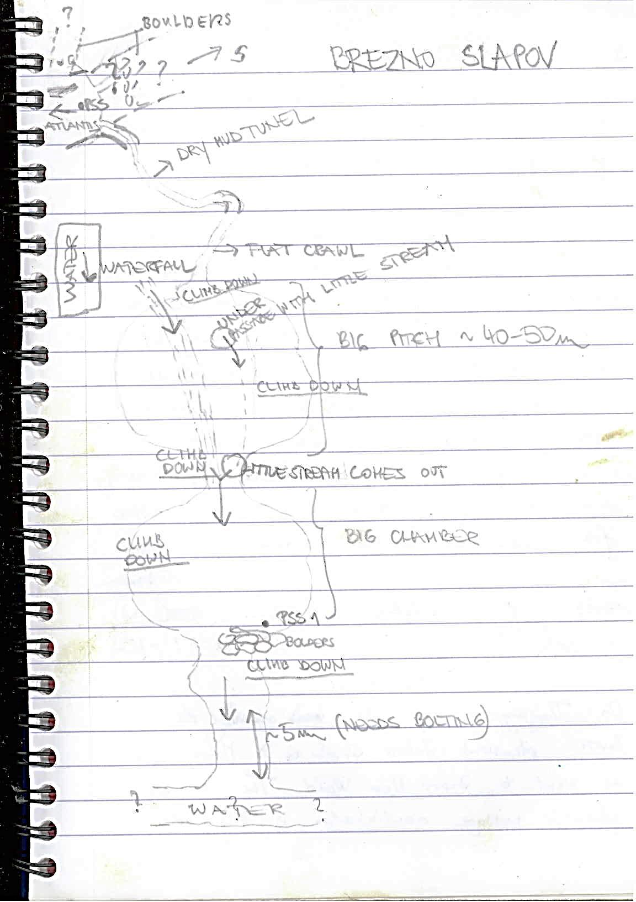\
[Jana’s sketch of Brezno Slapov]

**3 August 11.30 am Gergely**

Once again, in camp, with ‘Team Eastern Europe’! the first day, we went
to Minotaur Rift. Izi + Zejc climbed the window on the right and then
continued the climb in Queen’s Bedchamber; both projects are to be
finished. Jana and me went to Guillotine to rig the rift at the end. We
managed to get there with the 2 tacklesacks and rigged the pitch, but it
dies at the bottom. However, above us in the \~10m height a wider space
is visible. The rift is \~30m high. You can also see a window of the
continuing rift towards South. Another possibility would be to gain the
height at the beginning of the crawl; one can see \~15m up here.

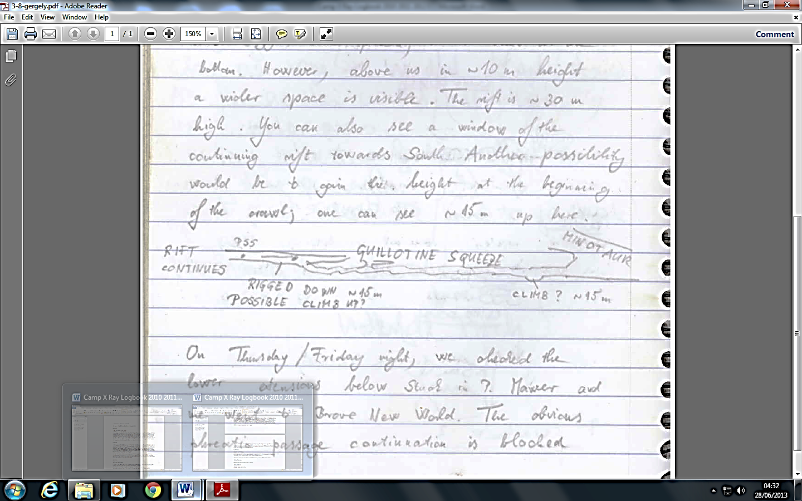\
[Gergely’s sketch of Guillotine]

On Thursday/Friday night, we checked the lower extensions below Stuck in
P. Mawer and me went to Brave New World. The obvious phreatic passage
continuation is blocked badly by collapsed ceiling (massive boulders).
Possible way should be towards the left, but we did not manage to get
through. It will be hard work. Strangely, we think that the draught
going out there is less than before. Part of it also goes up in the
rift/stream on the left, that we climbed \~10m, but it gets too small
after a small pool. We also tried to find a bypass to no avail. I think
that the eastern front will be hard to push.

On the other hand, Jana + Izi’s find is super interesting. The main S
passage (Atlantis) continues the same direction; I checked the pitch at
Atlantis & Minestrone (free climbable) and the passage goes at the
bottom! Plus the unwalked passage off Minestrone. Great leads there! The
southern front goes goes goes!

Good luck.

**3/8/2012 15:00 Tetley**

Back here with Rhys after 4 days of holiday in London! We’re off now to
look at Brave New World, may then check out other leads below Stuck in
Paradise.

We’ll leave note(s) to say where we are! Back here by 11am (4/8/12) at
the latest!

**3/8/12 18:00 Dan**

DAVE +DAN off to Big Rock. Back ≈20-00

**4/8/12 1100 Izi**

Gergely, Mawr, Jana in Izi

Prenooil 2 dni v kamp. Potiskal guillotine, Queen bed chamber in
Minotaur rift. Pri plezanhe nam ni vspek prit do vrha, tko da naslednje
leto. Zej je pocas cas da gremo wn, tho da blo je lpo kikr zmera, dobro
spanje, hrana in klapa.

HVALA ZA VSE….

**3/8/12 23:55 Dan**

A predictably faff-heavy start meant we didn’t get underground till
about 3:30. Down at X-ray at 6, stopping to faff + fettle + wake the
lighter sleepers of the night train (sorry ).

Got to Big-Rock and I started down with the drill etc to find glory. In
fact, I found a scary-arse traverse which I got about ½ way across. Dave
came down to join me and we made a tactical descision to approach the
remainder tomorrow, also ensuring we got back before buffalo-hour.
Meaty, cheesy, soupy smash consumed with relish.

Night train got out of the tent with surprising eagerness.

Comf donned, Jarv + Ollie returned from the deep. Great to be back at
camp (finally). Sleep now. Where is the whiskey?

**Sat 4^th^** **9:28 Jarv**

Tetley & Rhys arrive at an eye-watering 7:30 AM. We (Oli & I) returned
from the depths at two minutes to midnight.

We rigged two climbs down to the sump – BUT ** removed the natural
backup to the first one (we had sewn slings). So take +3m of webbing to
rig.

All ropes below Republica were pulled up into a state OK to leave for a
year.

We also moved Tetley’s brew kit bits to Red Cow itself + left a Daren of
\~4L water. About \~200ml meths left in the 2L sigg, a mess tin & fish
tin burner.

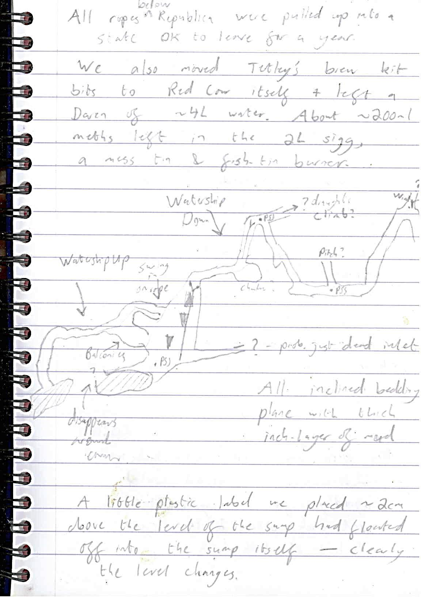\
[Jarv’s sketch of Watership Up]

A little plastic label we placed \~2cm above the level of the sump had
floated off into the sump itself – clearly the level changes.

So about to leave X-Ray & the expedition.

A pity the diving didn’t work out – perhaps some other time. I think an
attack on the Watership Down sump will require a capable & committed
team of Four with a week-fortnight to dedicate.

As part of this I think taking 100m of rope & a drill to protect all the
climbs in Leprecaun/Memory lane, setting a proper camp at Red Cow &
rerigging Republica + Insomnia (the terrible twins) in a suitably safe
fashion will be necessary steps. This is all obviously rather
far-fetched on a student expedition where everyone has their own plans &
intrigues.

So goodbye for this year – respect each other & the cave, and best of
luck with all your pushes.

**4/8/12 10 a.m. Tetley**

26 hrs after waking up (on the surface) I’m making final preparations
before sleep, drinking Long John and writing this. It’s been a long day,
but a great one. Brave New World goes! Squeezed through boulder choke to
reach INVICTUS – 70 odd metre of very fine sandy passage ending in a wet
pitch. About 20m to floor…. Left unpushed does the draught go up it or
down it? Slow journey back, deliberately so not to disturb day train.
Sleep now, at last!

**00:02 5/8/12 Tetley**

Tetley + Rhys have gone to push below Lower Pleasures. Callout: 11 a.m.

**5/8/12 10:30 Dan**

Great day yesterday finished the traverse to Big Rock’s big brother.
Very wet, quite sketchy but really fun. There’s a new way up from the
bottom of Big Rock, so no one needs to go there again. Except to derig
it The pitch on the other side is huge. We didn’t get very far down,
there’s \~60m of 9 ½ at the top for someone else to enjoy. To the
surface!

**5/8/12 11:00** **am** **Rhys**

Back for second night at camp. Strange day, I didn’t think Tetley or I
appreciated how knackered we were from our Brave New World push. We
started off with the idea of pushing Yorkshire but once into Lower
Pleasures we couldn’t work out where Oli and Thara had gone. We ended up
bolting down a small waterfall at the bottom of the big Lower Pleasures
pitch. We found an incredibly twatty immature streamway and decided to
get out because it was so rubbish. We then did a tourist trip to Cactus
Junction and the Fridge camp, which was really nice to see. Also looked
at the Big Rock parallel shaft that Dave and Dan were pushing. There’s
some heroic bolting there to get to what looks like (and sounds like) a
reasonably big pitch. Hoping to sleep for a while and head out early
Monday morning.

**5/8/12 18:00 Tetley**

Left at HAWAII (junction below Stuck in P.)

1 empty fish tin (a.k.a. meths stove!)

1 mess tin

1 daren drum full of water (can refill by placing under drips at bottom
of Stuck in Paradise)

600ml of meths

N.B. There is NO lighter there – Bring one if you want hot water!

\~20m of yellow rope

****

Climb in Brave New World now rigged using \~40m rope length (only about
8m is actually needed for this). Suggestion: rerig climb using short
rope and use the 40m length for exciting pitch at end of INVICTUS.

**5/8/12 21:00 Tetley**

Consciousness is slipping away again. We’ve been awake for 3 ½ hrs,
watched Withnail and I, and Red Dwarf. Only Rhys and I here, now back to
sleep hopefully.

**6/8/12 7:00 a.m. Tetley**

Excellent, another 9 hrs in bed! Feel well rested, Van Morrison’s
‘Gloria’ blasting out on the stereo, a big pot of tea is in front of
me….. life is good!

**6/8/12 7:20am Rhys**

Why is camp downwind of the shit area? Why?!

**6/8/12 8:20 a.m. Tetley**

Another meal of cheesy, soupy, fishy, smash. Classic! Only pepper
missing, I can see what drove the spice trade.

**6/8/12 10 a.m. Tetley**

We’re off to the surface. Thanks Rhys for another great weekend in the
underground. Good pushing all!

**7/8/12 8:30** **am** **Thara**

Tim and I (dreamt team) went for the glory at Big Rock (soon to be
called Stagger Lee). After arriveing at the camp around 830pm, faffed
around cooking, eating, drinking. We soon found that the camp was
without a drill bit.

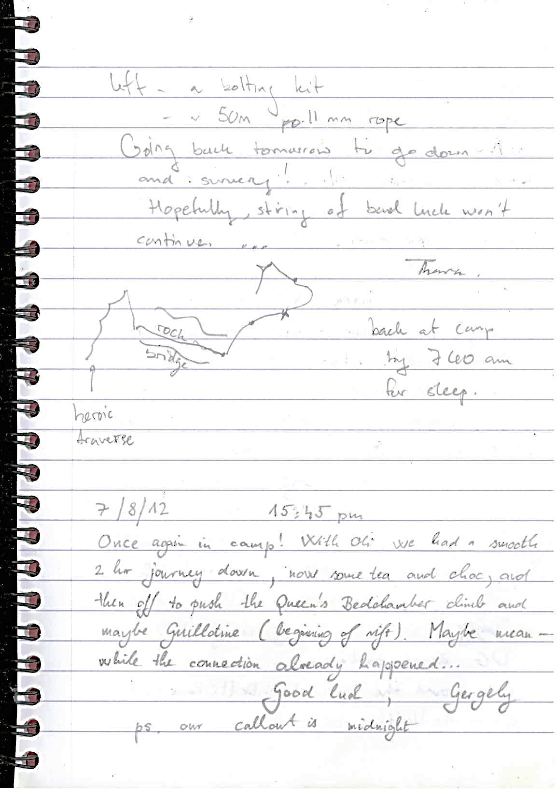Nevermind, old style bolting mission. Set off around 10pm to
Big Rock. After the first bolt we soon have a fucked driver. Rock here
was pretty, two bolts wasted as a proceed. However we managed to bolt
down to the second level, where Tim braved the drizzle (like Zimmer) and
tried to bolt down to the lower level.

Left

-   a bolting kit
-   \~50m 11mm rope

Going back tomorrow to go down and survey!

Hopefully, string of bad luck won’t continue…

\
[Thara’s sketch of Big Rock traverse ]

**7/8/12 15:45 pm Gergely**

Once again in camp! With Oli we had a smooth 2 hr journey down, now some
tea and choc, and then off to push the Queen’s Bedchamber climb and
maybe Guillotine (beginning of rift). Maybe meanwhile the connection
already happened…

Good luck, Gergely

ps. our callout is midnight

**7/8/12 JONNY (+ KATE) 23:00**

Nice trip down to camp before going to push Euphrates. Really shit rock
– 4 attempted bolts + lots of broken rock. However, super strong draft +
the pitch looks very promising.

! GO BACK ! (someone, not me…)

Surveying was a pain (cold, muddy, shit) BUT – Euphrates is now tied in
which is v. satisfying.

Looking forward to pushing elsewhere tomorrow.

UG dance routine:

Walk around the tent to Daft Punk’s Around the World!

**7/8/12 JONNY 00:30**

OLI on tacklesacks:

“It’s good, it’s like walking with a massive cock in my hand

Me on people not missing their callouts:

“Good, I can take off my furry”

**8/8/12 1:45 Gergely**

Pushing Queen’s Bedchamber was great; put in \~12 bolts, now we are at
the bottom of the rift, and \~8m higher the end of a phreatic can be
seen (maybe?) PLUS everything is covered w black dust, as the beginning
of King Minos palace! It really looks exciting. Altogether \~30 bolts in
the climb so far, one more session needed.

Whisky is good.

**8/8/12 3 pm Gergely**

Tim & Thara just got back from connection to Soda stream. Olli & me are
about to set off to Minestrone, trying the connection to Balamory. Our
callout is 10am on Thursday. Kate is still hesitating but probably she
and Jonny are going to come to the Atlantis area as well.

**8/8/12 4pm Thara**

Officially, we (Tim and I) are the connection makers (loopers).

We surveyed from the bottom Big Rock b/c we couldn’t find any Pss
station. Hopefully, we make a connection at the right place there.

-   Bottom of Big Rock Rope
-   A pile of spitzes (\~3)

Continued bolting down the pitch, Dan planned to descend. Tim put two
quick bolts (thanks to drill bit) and dropped down to the bottom which
is filled with human-size boulders stacked Jenga-like.

We looked for the obvious chamber by following the streamway.

3 bolts and we were at the bottom followed the stream for a few more
minutes until we realised that we were in Soda Streamway – CONNECION!
Again.

Slow surveyed the rest and derigged all the ropes.

3 possible leads (Not that exciting)

1.  Window at the same lvl as rock wall
2.  Window at the same lvl as traverse ledge
3.  Window \~3 metres above the bottom

The first two seem to head back into the rifts already explored. The
third seems to head towards Balimory.

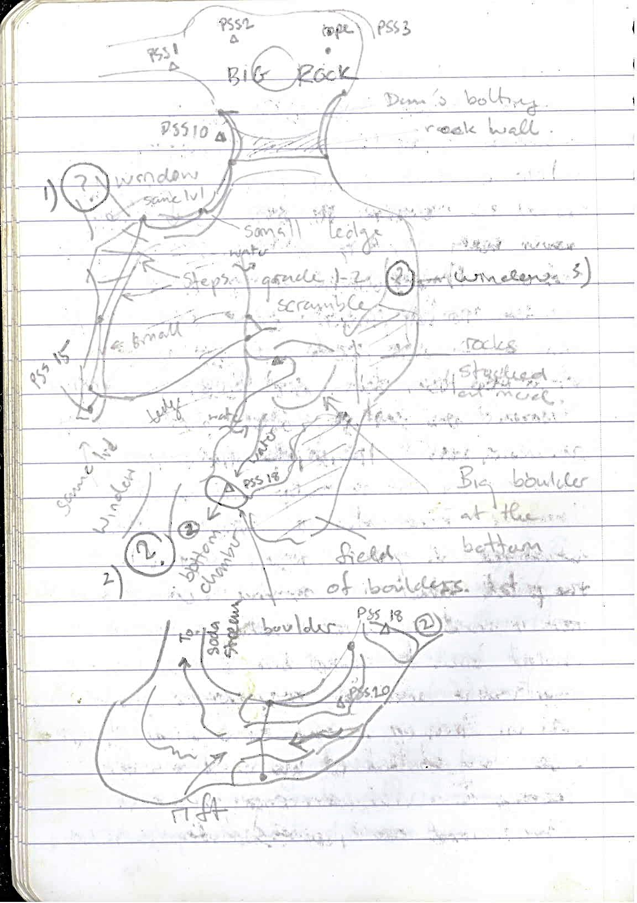\
[Thara’s sketch of Big Rock, with leads ]

**8/7/12 16:45 Kate**

Well, Jonath and myself set off from the Bivi yesterday and I realised
at the entrance that I just wasn’t that keen, we set off anyway thinking
that I was being silly and the enthusiasm would soon set in.
Unfortunately in the Urinal Series the fun had not begun, dear dear
Jonath was lovely and made me feel ok so we got to the big pitches and
things got better. It wasn’t any sort of extreme fear, just an
unwillingness to be in the fun caving state. We eventually got to camp
and set off to Xanadu/Euphrates to connect the survey which was v. grim.
Jonny tried to bolt the pitch which is v. blowing & cold but the rock is
shit and kept breaking. We headed back to camp but I still wasn’t
comfortable and was very shaky. After lots of dancing, which me & Jonath
happened to be very skilled at, we went to bed. Today I wasn’t keen to
go as far as Atlantis but really wanted to for Jonny so just as we were
about to set off Jonny realises that he’s also raptured and just wanted
to head out. Much to Gergely’s confusion we realised that neither of us
were super enthused then we should cut our losses and head out, freeing
up bed space for the mega-keen. We still accomplished the
Xanadu/Euphrates connection and have had a pleasent time. We shall
definitely be coming back super-pumped and ready for action, just this
time wasn’t meant to be.

Peace out

Kate x

Besides I quite need a shit and I have sworn to never poo underground.

**9/8/12 Thara 8:40** **am**

After two pushing trip, it is time to head up again. Have a good one!

**9/8/12 Gergely 8:45** **am**

We were badly defeated by the Almighty Chokes. Fighting w 2 today, the
Minestrone one seems to fill up the whole passage; the Inglorious
Basterd (starting at pitch at Atlantis/Minestrone) seems to be more
pushable, but we ran out of time & enthusiasm. Spent cca 7 hours
digging. Now time for sleep and maybe catch the sunset! Good luck.

**4:45 pm**

We head off & hope more dinner is left for us! Good times again, see you
one more time, Camp X-Ray!

**10/8/12 Erik/Matjer/Maffi**

We come to CAMP X RAY 00.30 sleep

8.00 we go to Queen CAMBER to climb a [illegible]. We climbed 20m and
finde a galerije more than CCA 400m

We don’t measure because of time.

In the end is a big chamber in wather is coming down. The gallery is
very muddy. In the end where is a chamber is a hole down cca 30m where
the wather is going. Now we are going out.

**10/08/12 9:50 pm Sam**

SO happy to be back – finally. Was apprehensive about coming down after
the adventures of last time – both coming down and going out turned into
mini epics, but coming down today just took us 2 ½ hours. Compared to
last time’s 5 hourish trip down, this felt like such a jolly. The 5
hours were due to an hour stuck at the top of skynet and another hour on
Zimmer’s rebelays, but the rebelays posed to problem today. I was fully
expecting to have to faff with footloops etc to pass the rebelays, but
no such thing was needed. Camp is as homely as I remember.

We passed the 3 Slov’s coming up at Tesalator – they had found a lot of
horizontal passage ending in a pitch; all of which they hadn’t surveyed.
Can’t remember where they had gone – I’m sure Clare will write in more
detail. We’re both interested in seeing and surveying the stuff they
have found – probably tomorrow’s mission. I think it will be good to do
more surveying – apparently the novelty wears off however…

**10/8/12 10:55 PM Clare**

Enjoying my first ever cigarette at UG camp while listening to Lou
Reed’s Walking on the Wild Side – a momentous occasion! Great to be back
at X-Ray, almost forgot how much I love underground camp after being
distracted by M2 for the past week. Just Sam and I here now. Whisky +
Blackadder then bed.

**11/8/12 10:52 AM Clare**

Sam and Clare off to Queen’s Bedchamber. Back by 2AM, 12/8/12.

**11/8/12 11:09 PM Clare**

Great day of pushing! Surveyed the passage found by Eric & co. and
pushed some new stuff. Almost 500m in the book! Named the bolt climb
APOLLO (as suggested by Gergely), and the horizontal stuff after that is
MILKY WAY. Three main leads in Milky Way – two pitches and one wide open
horizontal virgin passage (!!).

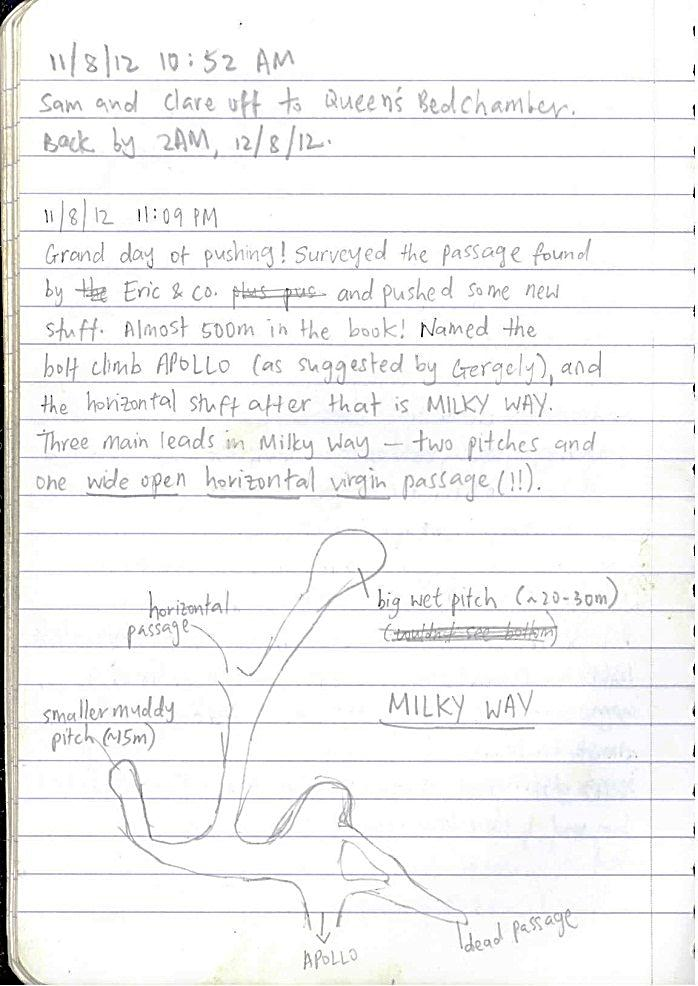\
[Clare’s map of Milky Way ]

Apollo was a super bolt climbing effort by Gergely, Izi, Maver and Eric!
It’s like Cheetah/Stuck in Paradise in reverse. Good to see their
efforts have paid off with so much passage. Immediately after Apollo is
a shitty handline/pitch climb down a muddy slope. Belays aren’t great so
take care!

Now in bed ensconced in TWO nitestars.

**12/8/12 9:20 AM Sam**

Had a great day yesterday. Clare mentioned that the amount of surveying
we did yesterday may be a record for a virgin surveyor. Hmm… data will
reveal all, but it definitely felt like a lot of surveying! Did get a
bit fed up with using the instruments towards the end. But the stuff we
found was very exciting – and there are existing leads that we left.
Today, we are heading out. Should be ok – long but it needs doing…

**12/9/12 9:25 AM Clare**

Maffi and Tjasa are here on the night train! They bottomed the big wet
pitch at end of Milky Way, leads to a narrow rift that’s still going.
It’s been a fantastic camp, can’t wait to be back next year!

**13.8.12 Tjasa**

We were at the end of Milkyway bolting the pitch. And everytime when we
are together in the cave we find some rifts

Then we woke up and it was around 3 at night. First we were confused and
then we realized that nobody comes in to the camp. We were a bit late to
go back to the end of the Milkway so we decided to wait until somebody
comes inside, we thought that that will be at 9 in the morning. But now
its 10^30^ and still nobody here.

Now: drinking tea, not knowing what to do & wondering what’s going on
outside… it’s pretty same every year at the underground camp

Aja: hvala za dobr kamp!

**13.8.12 Maffi**

I don’t know what to hope: That this underground adventures with Tjasa
will become a tradition or not! Like last year (my first time down here)
we found the narrowest and the longest wet passages possible again. But
those places are also so beautiful, that I hope someone will discover
big chambers with a lot of new leads on the other side, and meabe a
shortcut to get there , so many of you will have the motivation to go
there and see what we saw! For those of you who want, I’ll try to draw a
picture:

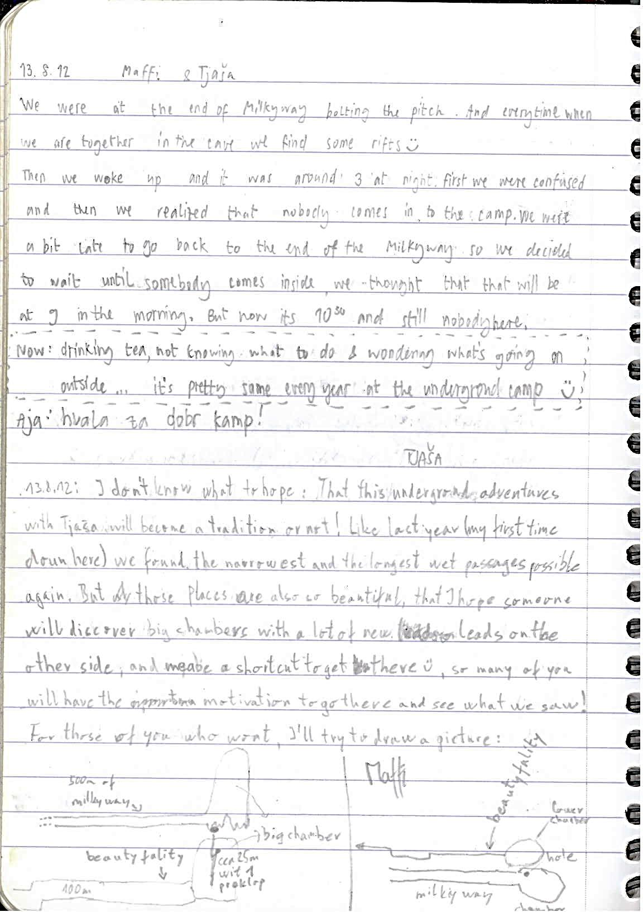\
[Maffi’s sketch of pitch at end of Milky Way ]

**14/8/2012 1:15 am Karin**

Long John time! We deserved it, we pushed the Vrtnarija for 70m (that’s
what Gergely said) down That means also that we found around 12km “new”
cave -\> it has a name -\> Sistem Migovec. I still can’t believe it.

We wanted to bolt to the right window in Queen’s Bedchamber, but the
drill broke. That’s why we went up left into Milky Way to check out the
unpushed passage. The direction and draft (+ cristals ) were showing us
that we’ll get somewhere near Sistem. But we didn’t expect that we’re
going actualy find the connection. Gergely said that we had luck. For a
few moments I also belived so (that’s when I saw the PSS13 – Waterloo)
but I don’t belive in luck, OK there is possibility that we had luck,
but that’s just a rare moment when you can’t explain it differently than
saying it was luck (if you ask me). However I don’t care what it was, we
found the connection and both of us are very happy .

Aja! I forgot, we called the passage Dreams for the Soul (or in SLO:
Sanje Za Duso) LP!

**Gergely**

Once upon a time, a black and a red furry went down to a cave and came
out at -70.

So today everything worked out like in a perfect fairy tale. We wanted
to climb, but the dwarves broke the cable. Then we followed the crystals
which eventually led to the hidden treasure: a bolt in the wall!
Waterloo is a nice chamber. We also found the continuation of
Guillotine/Minotaur rift. What a glorious end to this successful expo!
The connection is a proper teamwork, and we happened to be the lucky
ones, a great honor from Vrtnarija…

Now it is only 2 of us + the hot choc whiskey in the cave. Candle lit
dinner and happy times. It is like ahome in the mountain. All the best
until next year!

p.s. hot choc w whiskey is a great recipe!

**14/8 1pm Gergely**

The morning I felt absolutely shit, probably Karin illness My stomach is
still not too good, hopefully no problem on way out. Happy cavers emerge
from Friendship Gallery, packing up starts, it will be hard to go out…
But everything is illuminated by the Connection! Good-bye until next
year, Gergely.

**14/8 1pm Jonny**

So, an ordinary derig was made much less ordinary when Gergely + Karin
told me that the cave is now 70m deeper. Hooray for sys-mig.

